# First Card Tutorial

> **Build your first complete LCARS interface in 10 minutes**
> This step-by-step tutorial will guide you from a simple card to a functional LCARS panel.

---

## 🎯 What You'll Build

By the end of this tutorial, you'll create:
- ✅ LCARS header with ship name
- ✅ Interactive button that controls a light
- ✅ Status text showing sensor data
- ✅ LCARS footer completing the frame

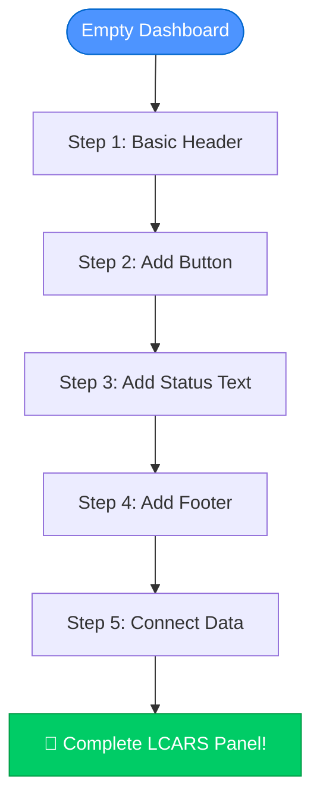

**Time Required:** ~10 minutes
**Difficulty:** Beginner
**Prerequisites:** LCARdS installed ([Installation Guide](installation.md))

---

## Tutorial Structure

This tutorial follows a **progressive enhancement** approach:

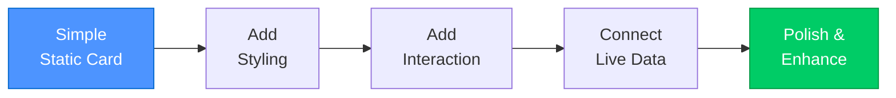

Each step builds on the previous one, so you can:
- ✅ Stop at any level and have a working card
- ✅ Understand what each property does
- ✅ Customize as you go
- ✅ Learn progressively

---

## Step 1: Create Your First Simple Button

Let's start with the simplest possible LCARdS card - a Simple Button.

### 1.1 Open Dashboard Editor

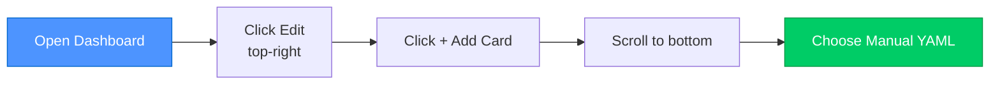

1. Open your Home Assistant dashboard
2. Click **Edit** (pencil icon, top-right)
3. Click **+ Add Card**
4. Scroll to bottom
5. Select **Manual** card (for YAML editing)

### 1.2 Paste Basic Button

```yaml
type: custom:lcards-button
preset: lozenge
text:
  label:
    content: "USS ENTERPRISE"
    position: center
style:
  card:
    color:
      background:
        active: 'var(--lcars-blue)'
```

**Save the card.** You should see a blue LCARS button with rounded ends displaying "USS ENTERPRISE".

### Understanding the Code

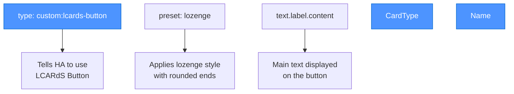

**Key Properties:**
- `type` - Which card to use (always `custom:lcards-elbow-card` for headers/footers)
- `lcards_card_type` - Which LCARS style (header, footer, button, etc.)
- `name` - Text to display on the card

### 1.3 Add a Label

Let's add more detail:

```yaml
type: custom:lcards-elbow-card
lcards_card_type: lcards-header
name: "USS ENTERPRISE"
label: "NCC-1701-D"
```

**Result:** You now have a ship name and registry number!

---

## Step 2: Add an Interactive Button

Now let's add a button that can control something.

### 2.1 Card Layout Concept

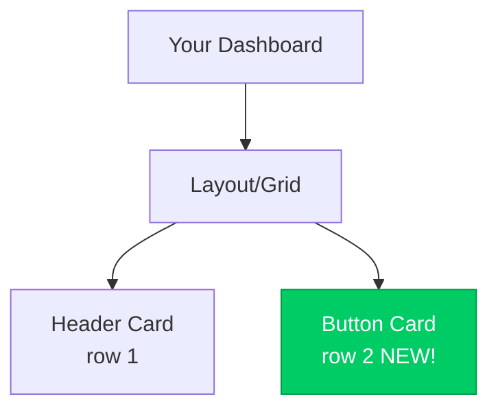

### 2.2 Create Button Card

**Add a new card** (same process as before):

```yaml
type: custom:lcards-button-card
lcards_card_type: lcards-button
name: "LIGHTS"
```

**Result:** A basic LCARS button!

### 2.3 Connect to Home Assistant Entity

Let's make it control a light:

```yaml
type: custom:lcards-button-card
lcards_card_type: lcards-button
entity: light.living_room
name: "LIVING ROOM"
show_state: true
tap_action:
  action: toggle
```

**Replace `light.living_room` with one of your entities!**

### Understanding Button Properties

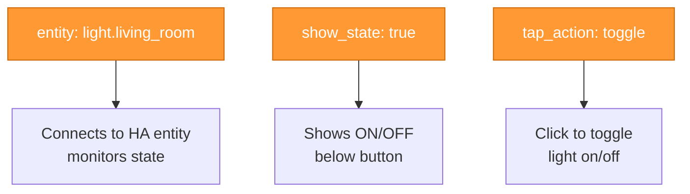

### 2.4 Add Icon

Make it more visual:

```yaml
type: custom:lcards-button-card
lcards_card_type: lcards-button
entity: light.living_room
name: "LIVING ROOM"
icon: mdi:lightbulb
show_state: true
tap_action:
  action: toggle
```

**Icon changes based on state!** (on = bright, off = dim)

---

## Step 3: Add Status Text

Display live sensor data with text overlays.

### 3.1 Text Card Concept

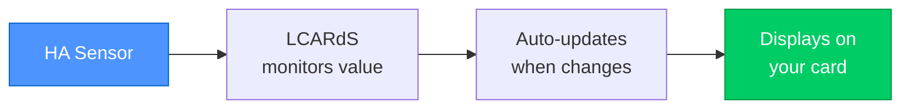

### 3.2 Simple Text Card

Add another card:

```yaml
type: custom:lcards-text-card
lcards_card_type: lcards-text
entity: sensor.temperature_living_room
name: "TEMPERATURE"
show_state: true
```

**Replace with your sensor entity!**

### 3.3 Format the Value

Add units and formatting:

```yaml
type: custom:lcards-text-card
lcards_card_type: lcards-text
entity: sensor.temperature_living_room
name: "TEMPERATURE"
show_state: true
state_display: "[[[return `${entity.state}°C`]]]"
```

**Now shows:** "22.5°C" instead of just "22.5"

---

## Step 4: Complete the Frame with Footer

LCARS interfaces have headers AND footers for that classic look.

### 4.1 Add Footer Card

```yaml
type: custom:lcards-elbow-card
lcards_card_type: lcards-footer
name: "DECK 1"
label: "MAIN BRIDGE"
```

### 4.2 Current Layout

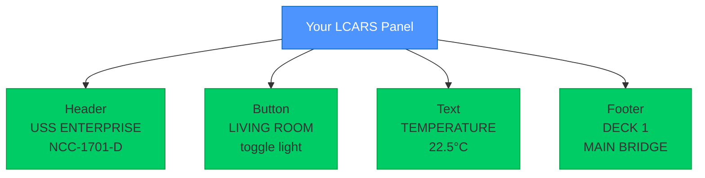

**You now have a complete LCARS frame!**

---

## Step 5: Add Color and Polish

Let's make it look more authentic.

### 5.1 Card Color System

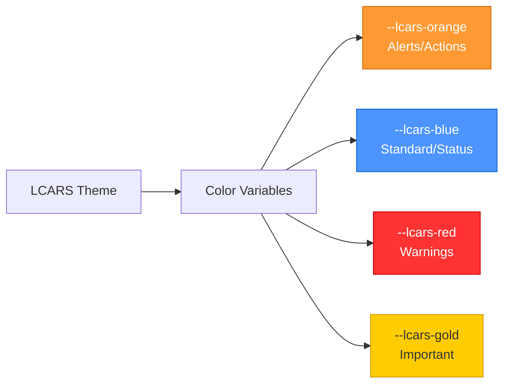

### 5.2 Add Colors to Header

```yaml
type: custom:lcards-elbow-card
lcards_card_type: lcards-header
name: "USS ENTERPRISE"
label: "NCC-1701-D"
styles:
  card:
    - --lcars-card-color: var(--lcars-orange)
```

### 5.3 Color the Button

```yaml
type: custom:lcards-button-card
lcards_card_type: lcards-button
entity: light.living_room
name: "LIVING ROOM"
icon: mdi:lightbulb
show_state: true
tap_action:
  action: toggle
styles:
  card:
    - --lcars-card-color: var(--lcars-blue)
```

### 5.4 Style the Footer

```yaml
type: custom:lcards-elbow-card
lcards_card_type: lcards-footer
name: "DECK 1"
label: "MAIN BRIDGE"
styles:
  card:
    - --lcars-card-color: var(--lcars-gold)
```

---

## Complete Example

Here's the full configuration for all cards:

### Full Dashboard YAML

```yaml
# Header Card
- type: custom:lcards-elbow-card
  lcards_card_type: lcards-header
  name: "USS ENTERPRISE"
  label: "NCC-1701-D"
  styles:
    card:
      - --lcars-card-color: var(--lcars-orange)

# Button Card
- type: custom:lcards-button-card
  lcards_card_type: lcards-button
  entity: light.living_room
  name: "LIVING ROOM"
  icon: mdi:lightbulb
  show_state: true
  tap_action:
    action: toggle
  styles:
    card:
      - --lcars-card-color: var(--lcars-blue)

# Text Card
- type: custom:lcards-text-card
  lcards_card_type: lcards-text
  entity: sensor.temperature_living_room
  name: "TEMPERATURE"
  show_state: true
  state_display: "[[[return `${entity.state}°C`]]]"

# Footer Card
- type: custom:lcards-elbow-card
  lcards_card_type: lcards-footer
  name: "DECK 1"
  label: "MAIN BRIDGE"
  styles:
    card:
      - --lcars-card-color: var(--lcars-gold)
```

**Remember:** Replace entity IDs with your own!

---

## Progressive Enhancement Examples

Want to go further? Here are some enhancements:

### Enhancement 1: Dynamic Button Colors

Make button color match light color:

```yaml
type: custom:lcards-button-card
lcards_card_type: lcards-button
entity: light.living_room
name: "LIVING ROOM"
icon: mdi:lightbulb
show_state: true
color: auto  # Matches light color!
tap_action:
  action: toggle
```

### Enhancement 2: Conditional Styling

Change color based on state:

```yaml
type: custom:lcards-text-card
lcards_card_type: lcards-text
entity: sensor.temperature_living_room
name: "TEMPERATURE"
show_state: true
state_display: "[[[return `${entity.state}°C`]]]"
state:
  - value: 0
    operator: "<"
    styles:
      card:
        - --lcars-card-color: var(--lcars-blue)  # Cold
  - value: 25
    operator: ">"
    styles:
      card:
        - --lcars-card-color: var(--lcars-red)  # Hot
```

### Enhancement 3: Animations

Add blink animation for alerts:

```yaml
type: custom:lcards-button-card
lcards_card_type: lcards-button
entity: binary_sensor.door_open
name: "DOOR STATUS"
icon: mdi:door
show_state: true
state:
  - value: "on"
    styles:
      card:
        - animation: blink 1s infinite
```

---

## Learning Path

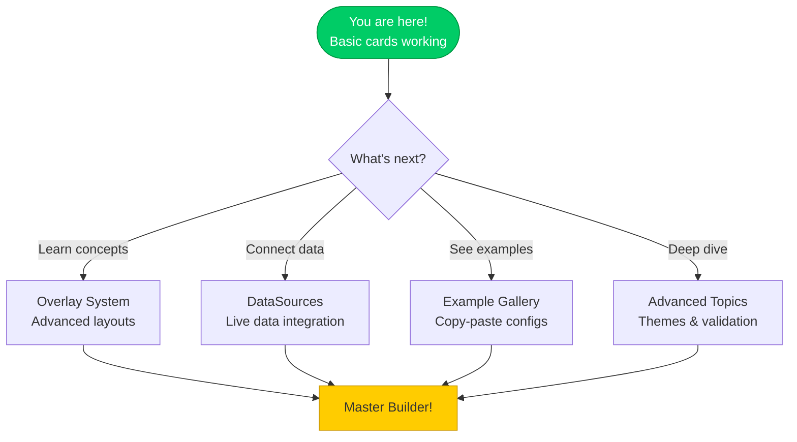

### Recommended Next Steps

**Level 2: Understand the System**
1. **[Overlay System Guide](../configuration/overlays/README.md)** - How overlays work
2. **[DataSource Guide](../configuration/datasources.md)** - Connecting to HA entities

**Level 3: More Examples**
3. **[Example Gallery](../examples/)** - Browse working configurations
4. **[Button Examples](../configuration/overlays/button-overlay.md)** - More button patterns

**Level 4: Advanced Topics**
5. **[Theme Creation](../advanced/theme_creation_tutorial.md)** - Create custom color schemes
6. **[Style Priority](../advanced/style-priority.md)** - Control style resolution
7. **[Actions](../advanced/msd-actions.md)** - Advanced button actions

---

## Common Patterns

### Pattern: Sensor Grid

Display multiple sensors in a grid:

```yaml
# Temperature
- type: custom:lcards-text-card
  lcards_card_type: lcards-text
  entity: sensor.temperature
  name: "TEMP"

# Humidity
- type: custom:lcards-text-card
  lcards_card_type: lcards-text
  entity: sensor.humidity
  name: "HUMIDITY"

# Pressure
- type: custom:lcards-text-card
  lcards_card_type: lcards-text
  entity: sensor.pressure
  name: "PRESSURE"
```

### Pattern: Control Panel

Group related controls:

```yaml
# Header
- type: custom:lcards-elbow-card
  lcards_card_type: lcards-header
  name: "LIGHTING CONTROL"

# Light buttons
- type: custom:lcards-button-card
  entity: light.room_1
  name: "ROOM 1"
  tap_action: {action: toggle}

- type: custom:lcards-button-card
  entity: light.room_2
  name: "ROOM 2"
  tap_action: {action: toggle}

# Footer
- type: custom:lcards-elbow-card
  lcards_card_type: lcards-footer
  name: "DECK 2"
```

### Pattern: Status Panel

Monitor system status:

```yaml
# Header
- type: custom:lcards-elbow-card
  lcards_card_type: lcards-header
  name: "SYSTEM STATUS"

# Status indicators
- type: custom:lcards-text-card
  entity: binary_sensor.door
  name: "MAIN DOOR"
  show_state: true

- type: custom:lcards-text-card
  entity: sensor.battery_level
  name: "POWER LEVEL"
  show_state: true

# Footer
- type: custom:lcards-elbow-card
  lcards_card_type: lcards-footer
  name: "ALL SYSTEMS NOMINAL"
```

---

## Troubleshooting

### Card doesn't update

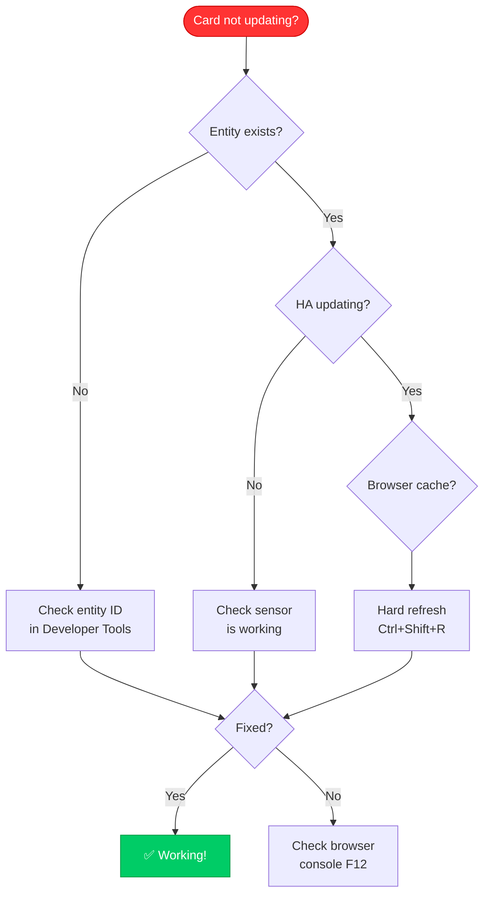

### Common Issues

| Problem | Solution |
|---------|----------|
| "Entity not found" | Check entity ID in Developer Tools → States |
| Card shows "Unavailable" | Entity might be offline, check its state |
| Button doesn't toggle | Verify `tap_action` is set correctly |
| Colors don't match | Make sure LCARS theme is active |
| Card looks different | Check `lcards_card_type` is spelled correctly |

### Getting Help

**Before asking for help:**
1. ✅ Check entity IDs are correct (Developer Tools → States)
2. ✅ Verify LCARS theme is active
3. ✅ Clear browser cache (Ctrl+Shift+R)
4. ✅ Check browser console for errors (F12)
5. ✅ Compare your config with examples in this tutorial

**Where to get help:**
- 📖 [Documentation](../../README.md)
- 🐛 [GitHub Issues](https://github.com/snootched/cb-lcars/issues)
- 💬 [Home Assistant Community](https://community.home-assistant.io/)

---

## Summary

**Congratulations!** 🎉

You've learned:
- ✅ How to create LCARS headers and footers
- ✅ How to add interactive buttons
- ✅ How to display live sensor data
- ✅ How to apply colors and styling
- ✅ Progressive enhancement techniques

### Your LCARS Journey

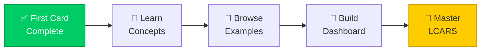

---

**What's Next?**

Choose your path:
- **[Overlay System](../configuration/overlays/README.md)** - Understand how overlays work
- **[DataSources](../configuration/datasources.md)** - Master data connections
- **[Example Gallery](../examples/)** - See what's possible
- **[Advanced Topics](../advanced/README.md)** - Deep dive into features

**Happy building!** 🖖

---

**Navigation:**
- 🏠 [Documentation Home](../../README.md)
- 🚀 [Quick Start](quickstart.md)
- 🔧 [Installation](installation.md)
- 📚 [User Guide](../README.md)
