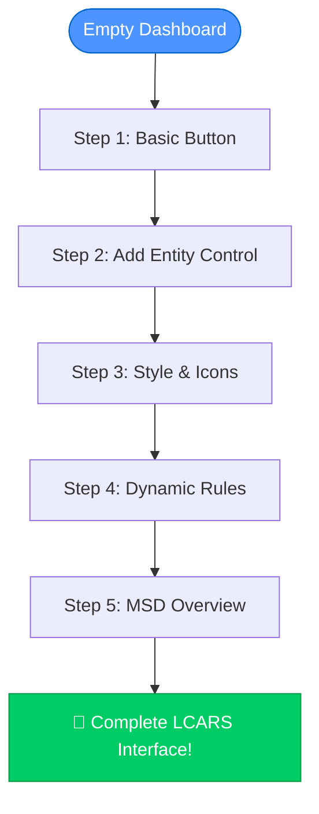
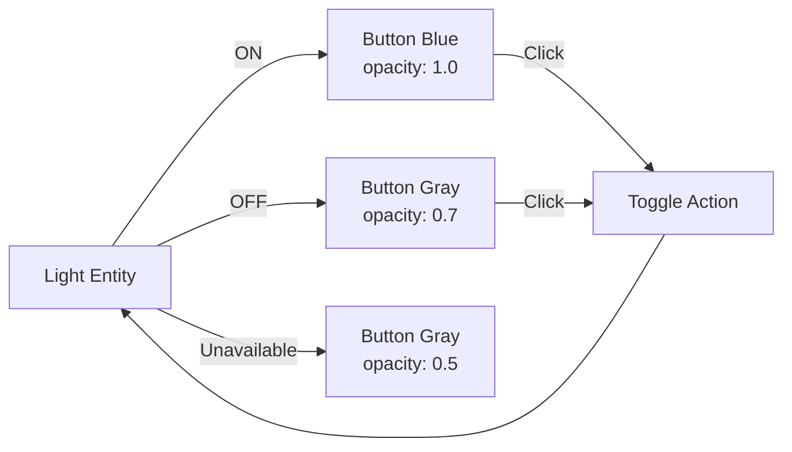
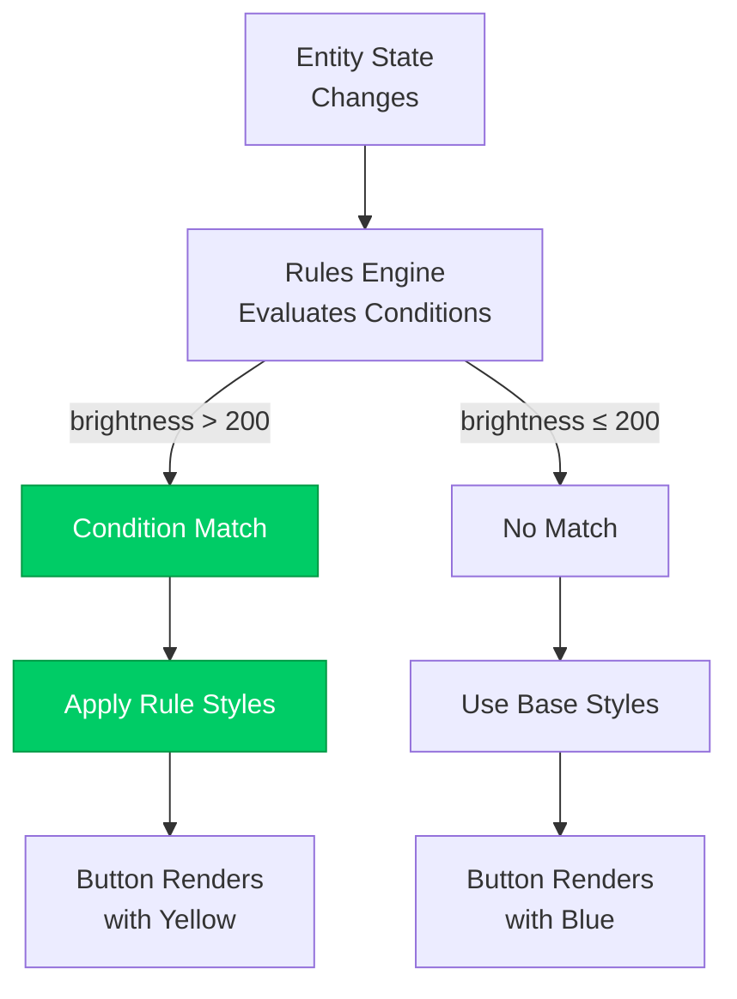

# First Card Tutorial

> **Build your first LCARS interface in 10 minutes**
> This step-by-step tutorial will guide you from a simple button to an interactive LCARS display.

---

## 🎯 What You'll Build

By the end of this tutorial, you'll create:
- ✅ Interactive Simple Button that controls a light
- ✅ Button with custom styling and icons
- ✅ Button with dynamic rules based on state
- ✅ (Optional) MSD card with overlay



**Time Required:** ~10 minutes  
**Difficulty:** Beginner  
**Prerequisites:** LCARdS installed ([Installation Guide](installation.md))

---

## Step 1: Create Your First Simple Button

Let's start with the simplest possible LCARdS card.

### 1.1 Open Dashboard Editor

1. Open your Home Assistant dashboard
2. Click **Edit** (pencil icon, top-right)
3. Click **+ Add Card**
4. Scroll to bottom
5. Select **Manual** card (for YAML editing)

### 1.2 Paste Basic Button

```yaml
type: custom:lcards-button
preset: lozenge
text:
  label:
    content: "USS ENTERPRISE"
    position: center
style:
  card:
    color:
      background:
        active: 'var(--lcars-blue)'
```

**Save the card.** You should see a blue LCARS button with rounded ends.

### Understanding the Code

- `type: custom:lcards-button` - Uses the LCARdS Button card
- `preset: lozenge` - Applies the lozenge style (fully rounded ends)
- `text.label.content` - The main text to display
- `style.card.color.background.active` - The button color using LCARS theme variables

---

## Step 2: Connect to a Home Assistant Entity

Let's make the button control a real entity!

### 2.1 Add Entity Control

```yaml
type: custom:lcards-button
entity: light.living_room  # ← Change this to your entity!
preset: lozenge
text:
  label:
    content: "Living Room"
    position: center
tap_action:
  action: toggle
style:
  card:
    color:
      background:
        active: 'var(--lcars-blue)'
        inactive: 'var(--lcars-gray)'
```

**Key Changes:**
- Added `entity` - Connects to your Home Assistant light
- Added `tap_action` - Makes it toggle the light when clicked
- Added `inactive` color - Shows gray when light is off

**Try it!** Click the button to toggle your light on and off!

### 2.2 Understanding Entity States



The Simple Button automatically:
- ✅ Monitors entity state
- ✅ Changes appearance based on state
- ✅ Adjusts opacity automatically
- ✅ Handles actions via Home Assistant

---

## Step 3: Add Icons and Styling

Let's make it look more authentic!

### 3.1 Add an Icon

```yaml
type: custom:lcards-button
entity: light.living_room
preset: lozenge
icon_area: left
icon:
  icon: mdi:lightbulb
  position: center
  size: 28
  color:
    active: 'yellow'
    inactive: 'gray'
text:
  label:
    content: "Living Room"
    position: center
tap_action:
  action: toggle
style:
  card:
    color:
      background:
        active: 'var(--lcars-orange)'
        inactive: 'var(--lcars-gray)'
```

**New Features:**
- `icon_area: left` - Reserves space on the left for the icon
- `icon.icon: mdi:lightbulb` - Uses Material Design Icons
- `icon.color` - Icon changes color based on state
- Changed background to orange for variety

### 3.2 Add Multiple Text Fields

```yaml
type: custom:lcards-button
entity: light.living_room
preset: lozenge
icon_area: left
icon:
  icon: mdi:lightbulb
  position: center
text:
  title:
    content: "LIVING ROOM"
    position: top-center
    font_size: 16
    font_weight: bold
  status:
    content: "{entity.state}"
    position: bottom-center
    font_size: 12
tap_action:
  action: toggle
style:
  card:
    color:
      background:
        active: 'var(--lcars-orange)'
        inactive: 'var(--lcars-gray)'
```

**Multi-Text Features:**
- Multiple text fields with different positions
- `{entity.state}` - Template showing current state (on/off)
- Custom font sizes per field

---

## Step 4: Add Dynamic Rules

Let's make the button change color based on brightness!

### 4.1 Rules for Brightness

```yaml
type: custom:lcards-button
entity: light.living_room
preset: lozenge
icon_area: left
icon:
  icon: mdi:lightbulb
  position: center
text:
  label:
    content: "Living Room"
    position: center
  brightness:
    content: "{entity.attributes.brightness || 'OFF'}"
    position: bottom-right
    font_size: 11
tap_action:
  action: toggle
style:
  card:
    color:
      background:
        active: 'var(--lcars-blue)'
        inactive: 'var(--lcars-gray)'
rules:
  - when:
      condition: "entity.attributes.brightness > 200"
      type: javascript
    apply:
      style:
        card:
          color:
            background:
              active: 'var(--lcars-yellow)'
```

**How Rules Work:**
1. **Condition** - Checks if brightness > 200
2. **Apply** - Changes background to yellow when true
3. **Result** - Button is:
   - Blue when brightness ≤ 200
   - Yellow when brightness > 200
   - Gray when off

### 4.2 Understanding the Rules Engine



**Rules capabilities:**
- Check entity attributes
- Use JavaScript, Jinja2, or token syntax
- Apply style overrides dynamically
- Work with all Simple Button properties

📖 **Learn More:** [Rules Engine Guide](../configuration/rules.md)

---

## Step 5: Master Systems Display (MSD) Overview

For more complex interfaces, use the MSD card!

### 5.1 Basic MSD with Button Overlay

```yaml
type: custom:lcards-msd-card
msd:
  version: 1
  base_svg:
    source: "builtin:ncc-1701-d"
    opacity: 0.3
  overlays:
    - id: bridge_control
      type: button
      position: [200, 100]
      size: [140, 50]
      label: "BRIDGE"
      tap_action:
        action: navigate
        navigation_path: /lovelace/bridge
      style:
        color: var(--lcars-orange)
    
    - id: engineering_control
      type: button
      position: [200, 170]
      size: [140, 50]
      label: "ENGINEERING"
      entity: light.engineering
      tap_action:
        action: toggle
      style:
        color: var(--lcars-blue)
```

**MSD Features:**
- SVG base layer (built-in ships or custom)
- Multiple overlays (buttons, text, status grids, charts, lines)
- Shared datasources
- Global rules engine
- Complex positioning

### 5.2 When to Use Each Card Type

| Use Case | Card Type | Why |
|----------|-----------|-----|
| Single button control | Simple Button | ✅ Lightweight, fast, self-contained |
| Entity status display | Simple Button | ✅ Easy setup, automatic state handling |
| Navigation button | Simple Button | ✅ Simple action configuration |
| Ship diagram with controls | MSD Card | ✅ Multiple overlays, visual context |
| Status dashboard | MSD Card | ✅ Multiple entities, complex layout |
| Charts and graphs | MSD Card | ✅ ApexCharts overlay support |
| Connected lines/indicators | MSD Card | ✅ Line overlay with attachment points |

---

## What's Next?

Now that you have the basics, explore more features:

### Simple Button Deep Dive
- 📖 [Simple Button Quick Reference](../configuration/button-quick-reference.md)
- 🎨 [Theme Tokens and Styling](../advanced/theme_creation_tutorial.md)
- 📜 [Rules Engine Guide](../configuration/rules.md)

### MSD Exploration
- 📖 [Overlay Configuration](../configuration/overlays/README.md)
- 💾 [DataSource System](../configuration/datasources.md)
- 🎯 [Status Grid Overlays](../configuration/overlays/status-grid-overlay.md)
- 📊 [ApexCharts Integration](../configuration/overlays/apexcharts-overlay.md)

### Advanced Topics
- 🏗️ [Core/Singleton Architecture](../../architecture/overview.md)
- 🎬 [Animation System](../guides/animations.md)
- 🔍 [Console API](../advanced/CONSOLE_HELP_QUICK_REF.md)

---

## Troubleshooting

### Button Doesn't Appear
- ✅ Clear browser cache (Ctrl+Shift+R)
- ✅ Verify LCARS theme is active
- ✅ Check browser console for errors (F12)
- ✅ Confirm LCARdS is installed via HACS

### Button Not Interactive
- ✅ Verify entity exists in Home Assistant
- ✅ Check entity ID spelling
- ✅ Ensure `tap_action` is configured

### Colors Don't Match
- ✅ Activate `LCARS Picard [cb-lcars]` theme
- ✅ Use `var(--lcars-*)` color variables
- ✅ Check theme token references

### Rules Not Working
- ✅ Verify condition syntax (JavaScript, Jinja2, or token)
- ✅ Check entity attributes exist
- ✅ Use browser console to debug (F12)
- ✅ Test condition in HA template tool

---

## Summary

**Congratulations!** 🎉 You've learned:

- ✅ How to create Simple Button cards
- ✅ Connect buttons to Home Assistant entities
- ✅ Add icons and multi-text labels
- ✅ Use the Rules Engine for dynamic styling
- ✅ When to use Simple Button vs MSD cards

**Key Takeaways:**
1. **Simple Button** - Best for single-purpose controls and displays
2. **MSD Card** - Best for complex multi-element interfaces
3. **Singleton Architecture** - Rules and themes work across all cards
4. **Templates** - Use `{entity.*}` to display live data
5. **Rules** - Dynamic styling based on state/attributes

**Ready for more?** Continue to [Advanced Configuration](../configuration/) or explore the [Architecture](../../architecture/) to understand how LCARdS works under the hood!

---

*Last Updated: November 2025*
