# Installation Guide

> **Complete installation instructions for LCARdS**
> Choose between HACS (recommended) or manual installation.

---

## 📋 Overview

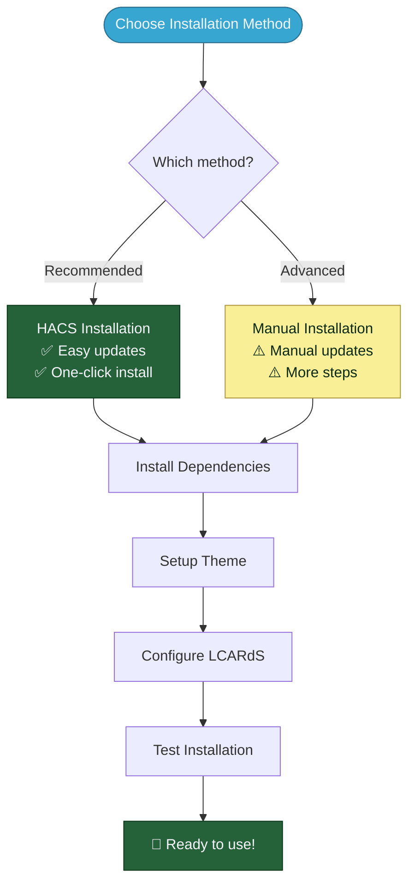

---

## Prerequisites

Before installing LCARdS, ensure you have:

- ✅ **Home Assistant** - Version 2023.1 or newer (recommended)
- ✅ **HACS Installed** - [Home Assistant Community Store](https://hacs.xyz/docs/setup/download)
- ✅ **Admin Access** - Ability to install custom components
- ✅ **Modern Browser** - Chrome, Firefox, Safari, or Edge (recent versions)

---

## Installation Method 1: HACS (Recommended)

### Why HACS?

- ✅ **Easy updates** - One-click updates when new versions release
- ✅ **Automatic setup** - Handles file placement and configuration
- ✅ **Dependency tracking** - Helps manage required cards
- ✅ **Community standard** - Most HA users use HACS

### HACS Installation Flow

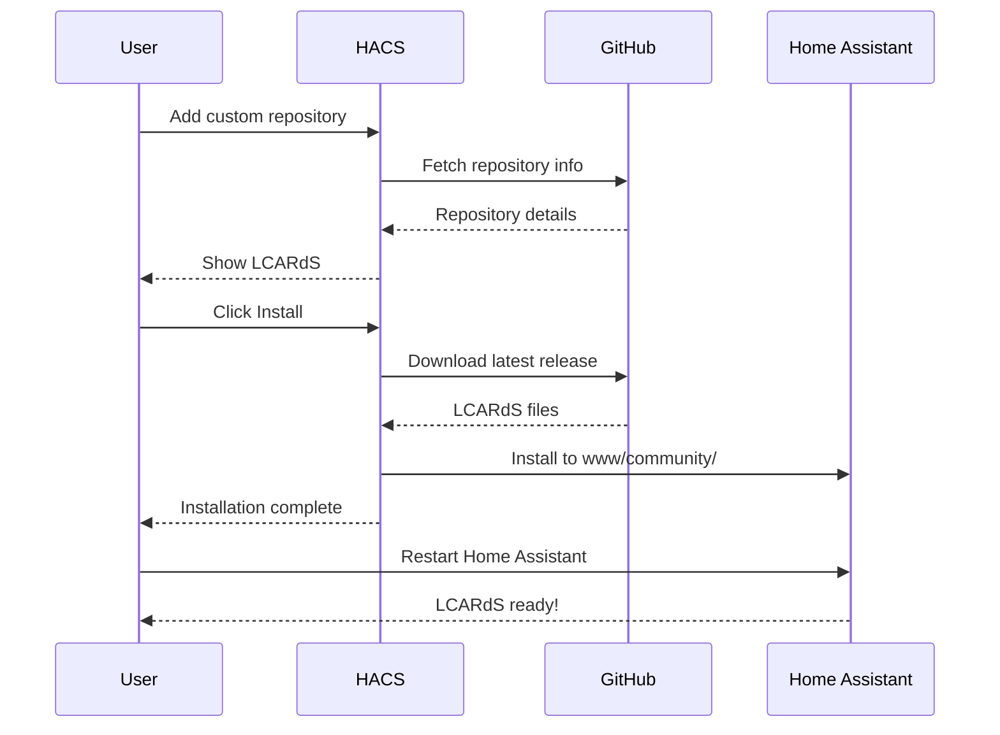

### Step-by-Step: HACS Installation

#### 1. Add LCARdS Repository

**Option A: One-Click (Easiest)**

[](https://my.home-assistant.io/redirect/hacs_repository/?owner=snootched&repository=cb-lcars)

**Option B: Manual**

1. Open **HACS** from your Home Assistant sidebar
2. Click **Frontend** tab
3. Click ⋮ (three dots menu, top-right)
4. Select **Custom repositories**
5. Enter repository URL:
   ```
   https://github.com/snootched/cb-lcars
   ```
6. Category: **Lovelace**
7. Click **Add**

#### 2. Install LCARdS

1. In HACS → Frontend, search for "LCARdS"
2. Click on **LCARdS**
3. Click **Download** (bottom-right)
4. Select latest version (or specific version if needed)
5. Click **Download** again to confirm

#### 3. Restart Home Assistant

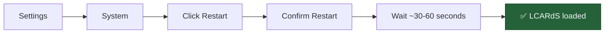

**Navigation:** Settings → System → Restart

---

## Installation Method 2: Manual Installation

### Manual Installation Flow

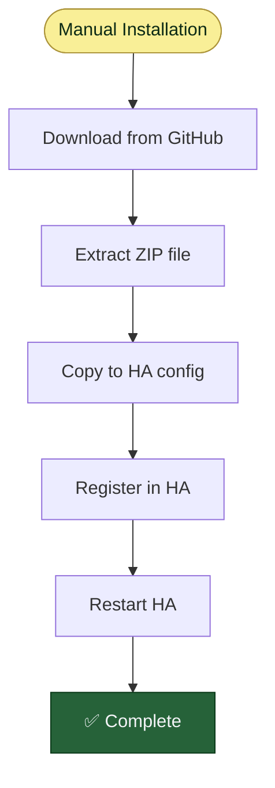

### Step-by-Step: Manual Installation

#### 1. Download LCARdS

1. Visit: [https://github.com/snootched/cb-lcars/releases](https://github.com/snootched/cb-lcars/releases)
2. Download the latest release ZIP file
3. Extract the ZIP to a temporary location

#### 2. File Structure

Your extracted files should look like:

```
cb-lcars/
├── dist/
│   └── cb-lcars.js          ← Main file
├── src/
│   └── *.yaml               ← Configuration files
└── README.md
```

#### 3. Copy Files to Home Assistant


**Target location:**
```
/config/www/community/cb-lcars/
```

Copy the entire `cb-lcars` folder contents to this location.

#### 4. Register as Lovelace Resource

1. Go to **Settings → Dashboards**
2. Click ⋮ (three dots, top-right)
3. Select **Resources**
4. Click **+ Add Resource**
5. Enter:
   - **URL:** `/local/community/cb-lcars/cb-lcars.js`
   - **Type:** `JavaScript Module`
6. Click **Create**

#### 5. Restart Home Assistant

**Navigation:** Settings → System → Restart

---

## Required Dependencies

LCARdS needs these other custom components to work:

### Dependencies Installation Flow

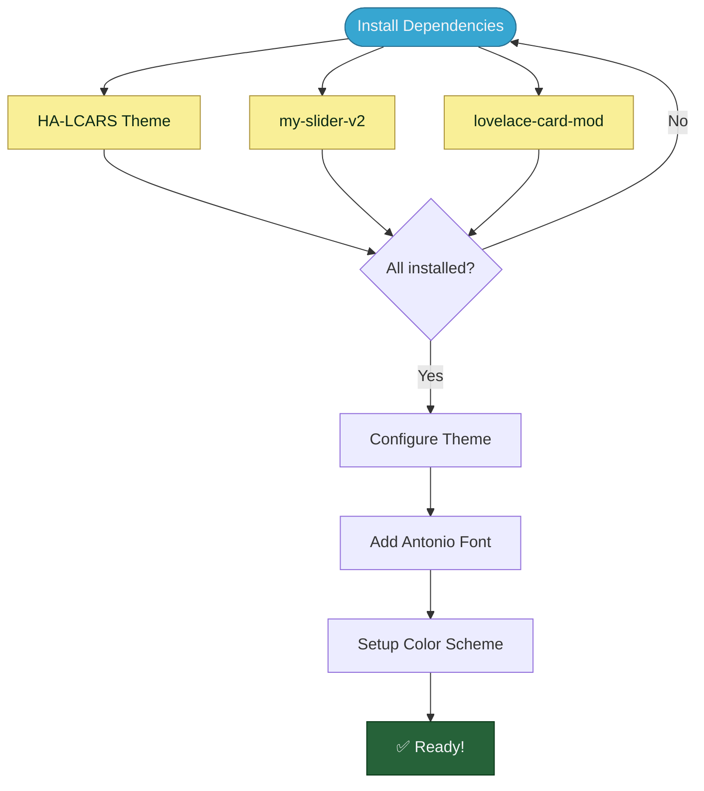

### 1. HA-LCARS Theme (Required)

**Repository:** [https://github.com/th3jesta/ha-lcars](https://github.com/th3jesta/ha-lcars)

**Install via HACS:**
1. HACS → Frontend
2. Search "HA-LCARS"
3. Install
4. Restart HA

**Why required?** Provides base LCARS styling, colors, and fonts.

### 2. my-slider-v2 (Required)

**Repository:** [https://github.com/AnthonMS/my-cards](https://github.com/AnthonMS/my-cards)

**Install via HACS:**
1. HACS → Frontend
2. Search "my-slider"
3. Install **my-slider-v2**
4. Restart HA

**Why required?** Powers the Multimeter card sliders and gauges.

### 3. lovelace-card-mod (Required)

**Repository:** [https://github.com/thomasloven/lovelace-card-mod](https://github.com/thomasloven/lovelace-card-mod)

**Install via HACS:**
1. HACS → Frontend
2. Search "card-mod"
3. Install
4. Restart HA

**Why required?** Enables Symbiont mode (card encapsulation) and advanced styling.

### 4. Optional: lovelace-layout-card

**Repository:** [https://github.com/thomasloven/lovelace-layout-card](https://github.com/thomasloven/lovelace-layout-card)

**Why optional?** Useful for advanced dashboard layouts, but not required by LCARdS.

---

## Theme Configuration

### Setup LCARS Theme


### 1. Add Antonio Font

Add to your `configuration.yaml`:

```yaml
frontend:
  themes: !include_dir_merge_named themes
  extra_module_url:
    - https://fonts.googleapis.com/css2?family=Antonio:wght@100..700&display=swap
```

**Font Weights:**
- 100-200: Ultra-thin (Picard-era displays)
- 300-400: Normal text
- 500-700: Bold headers and labels

> 💡 **Note:** LCARdS includes Microgramma and Jeffries fonts automatically.

### 2. Install LCARdS Color Scheme

#### Theme Color Hierarchy

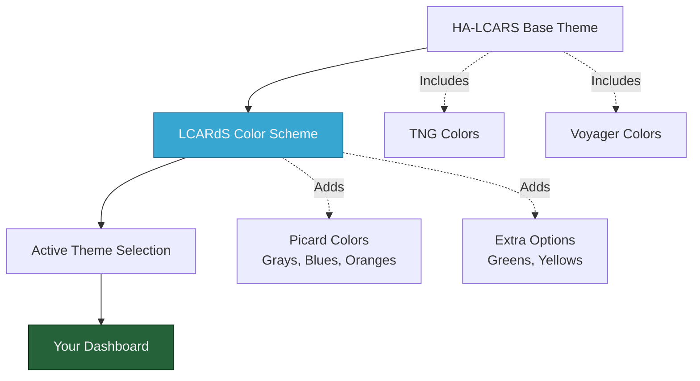

#### Installation Steps

1. **Copy color scheme:**
   - Source: `ha-lcars-theme/lcards-lcars.yaml` (in LCARdS repo)
   - Destination: Your HA-LCARS `lcars.yaml` file

2. **Location in Home Assistant:**
   ```
   /config/themes/lcars.yaml
   ```

3. **Add the theme definition:**
   Copy the entire `LCARS Picard [cb-lcars]` section from `lcards-lcars.yaml`

4. **Activate theme:**
   - Settings → Themes
   - Select `LCARS Picard [cb-lcars]`
   - Set as default (optional)

#### Picard Color Scheme


**Color Palette:**
- **Grays** - Backgrounds, borders
- **Blues** - Primary interactive elements
- **Oranges** - Alerts, highlights
- **Greens** - Success states, active elements
- **Yellows** - Warnings, secondary actions

---

## File Structure After Installation

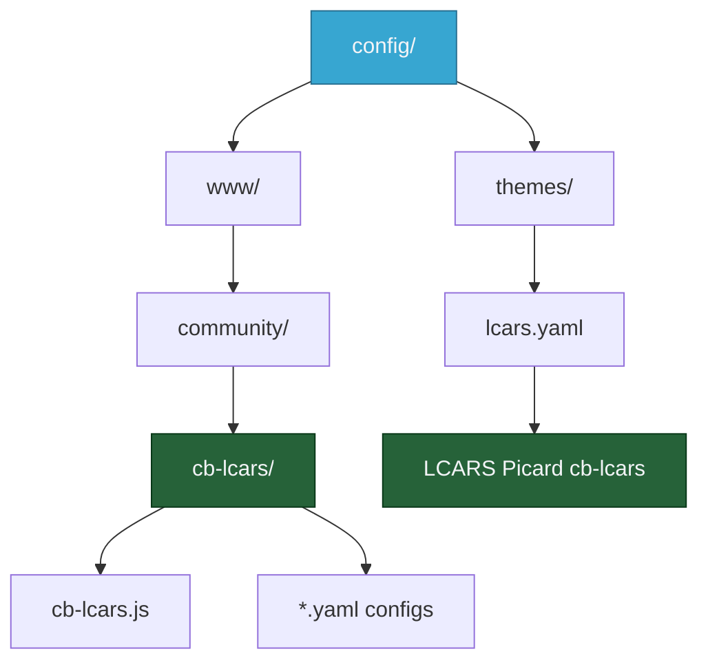

**Expected structure:**

```
config/
├── www/
│   └── community/
│       └── cb-lcars/
│           ├── cb-lcars.js         ← Main JavaScript
│           └── src/                ← Configuration files
├── themes/
│   └── lcars.yaml                  ← Theme with LCARdS colors
└── configuration.yaml              ← Font reference
```

---

## Verification & Testing

### Installation Checklist

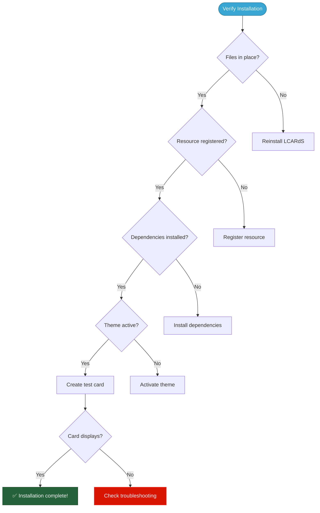

### Quick Test

Create this test card to verify installation:

```yaml
type: custom:lcards-button
preset: lozenge
text:
  label:
    content: "INSTALLATION TEST"
  name:
    content: "LCARdS"
    position: top-left
style:
  card:
    color:
      background:
        active: 'var(--lcars-blue)'
```

**Expected:** Blue LCARS header with text.

---

## Troubleshooting

### Common Issues & Solutions

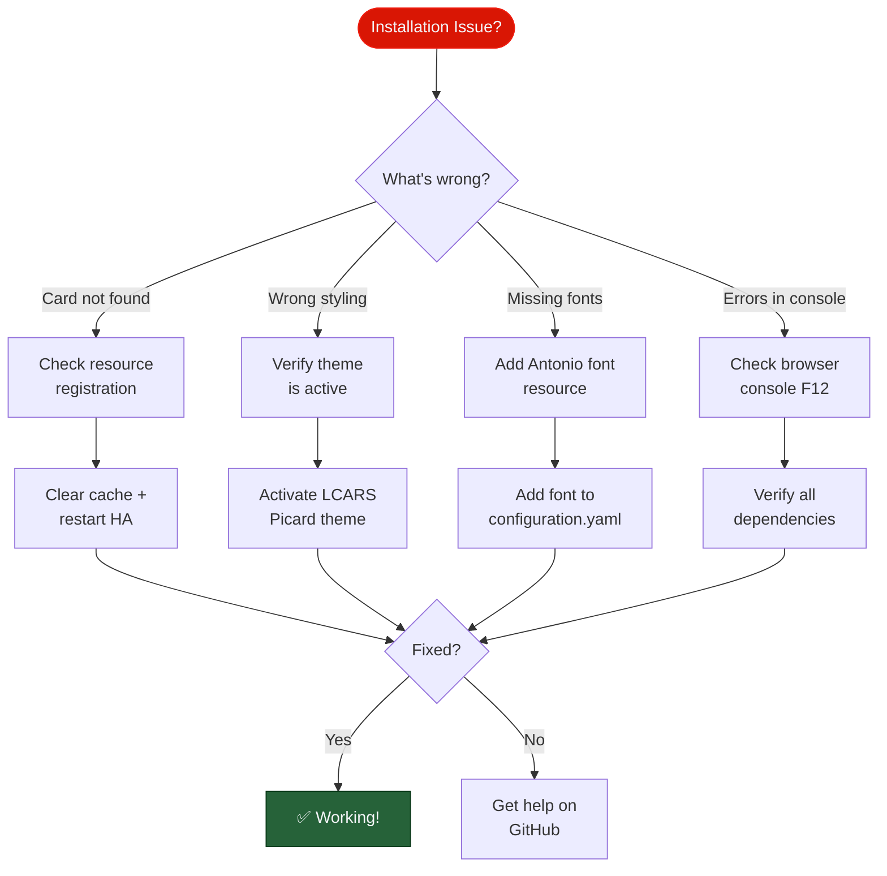

### Issue: "Custom element doesn't exist: lcards-button"

**Causes:**
- Resource not registered
- Cache not cleared
- HA not restarted

**Solutions:**
1. Clear browser cache (Ctrl+Shift+R)
2. Verify resource registration in Settings → Dashboards → Resources
3. Restart Home Assistant
4. Check browser console (F12) for load errors

### Issue: Wrong colors or missing styling

**Causes:**
- Theme not active
- Wrong theme selected
- Theme not installed

**Solutions:**
1. Go to Settings → Themes
2. Verify HA-LCARS is installed
3. Select `LCARS Picard [cb-lcars]`
4. Hard refresh browser (Ctrl+Shift+R)

### Issue: Fonts look wrong

**Causes:**
- Antonio font not loaded
- Font resource missing
- Browser font cache

**Solutions:**
1. Add Antonio font to `configuration.yaml` (see Theme Configuration)
2. Clear browser cache
3. Check browser console for font load errors
4. LCARdS will auto-load fonts if missing (may be slower)

### Issue: Cards show but interactions don't work

**Causes:**
- Missing dependencies
- card-mod not installed
- JavaScript errors

**Solutions:**
1. Verify all dependencies installed (see Dependencies section)
2. Check browser console for errors
3. Reinstall LCARdS and dependencies
4. Clear cache + restart HA

---

## Updating LCARdS

### HACS Updates

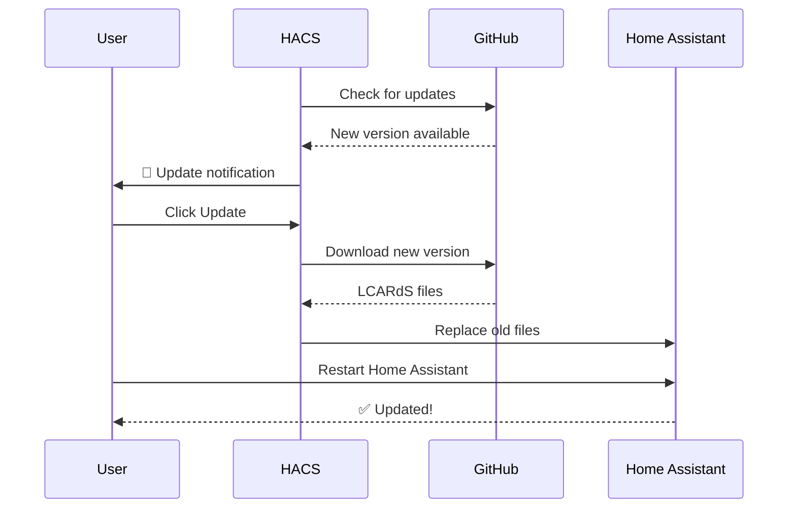

**Update Process:**
1. HACS will notify you of updates
2. Go to HACS → LCARdS
3. Click **Update**
4. Restart Home Assistant
5. Clear browser cache

### Manual Updates

1. Download latest release from GitHub
2. Delete old `cb-lcars` folder
3. Copy new files to `/config/www/community/cb-lcars/`
4. Restart Home Assistant
5. Clear browser cache

---

## Uninstallation

If you need to remove LCARdS:

### HACS Uninstall

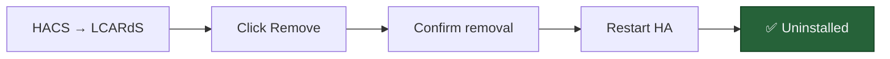

1. HACS → Frontend → LCARdS
2. Click ⋮ (menu) → Remove
3. Confirm removal
4. Restart Home Assistant

### Manual Uninstall

1. Delete `/config/www/community/cb-lcars/` folder
2. Remove resource registration (Settings → Dashboards → Resources)
3. Remove any LCARdS cards from dashboards
4. Restart Home Assistant

---

## Next Steps

**Installation complete!** 🎉

Now that LCARdS is installed:

1. **[Quick Start Guide](quickstart.md)** - Create your first card in 5 minutes
2. **[First Card Tutorial](first-card.md)** - Build a complete interface
3. **[Overlay System](../configuration/overlays/README.md)** - Add dynamic elements
4. **[Example Gallery](../examples/)** - Browse configurations

---

**Navigation:**
- 🏠 [Documentation Home](../../README.md)
- 🚀 [Quick Start](quickstart.md)
- 📖 [First Card Tutorial](first-card.md)
- 🎨 [Example Gallery](../examples/)
