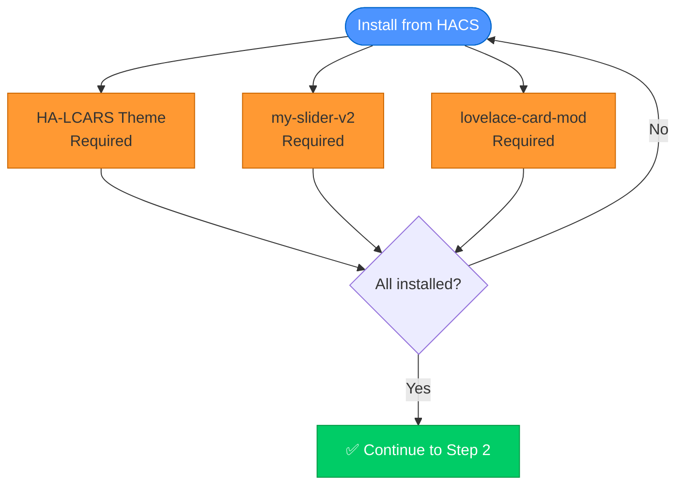
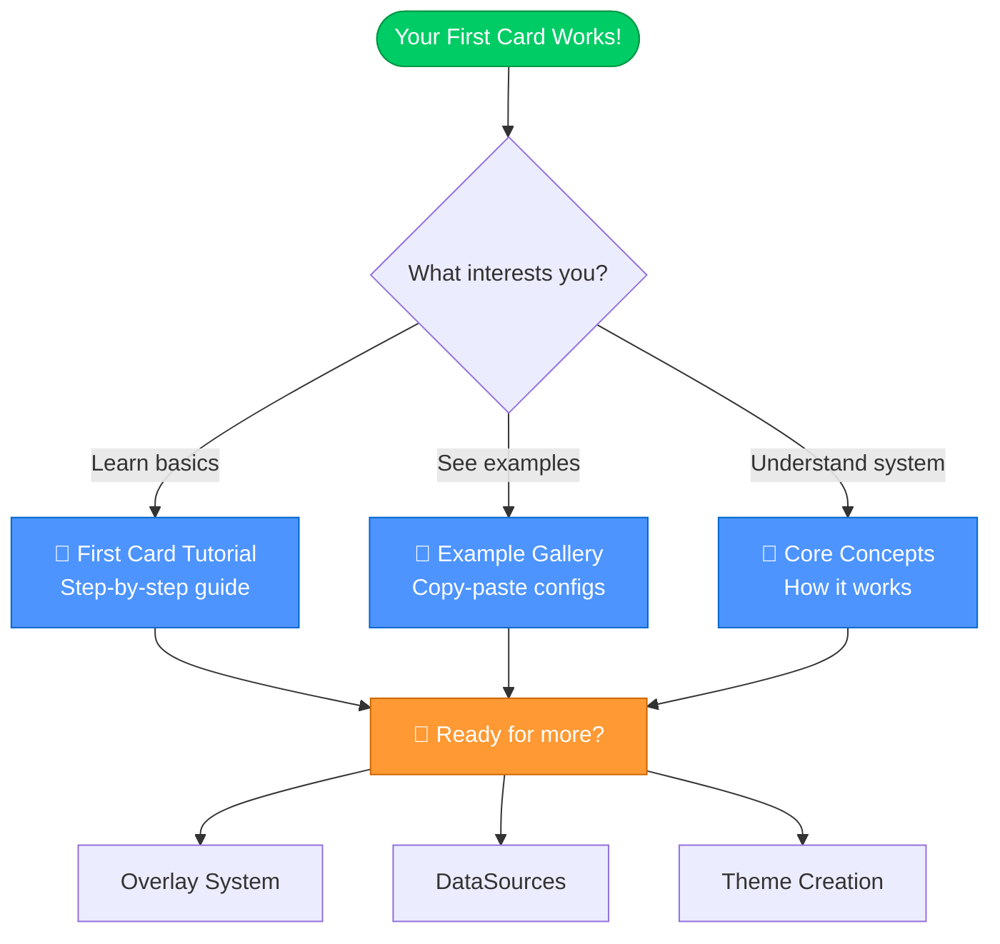
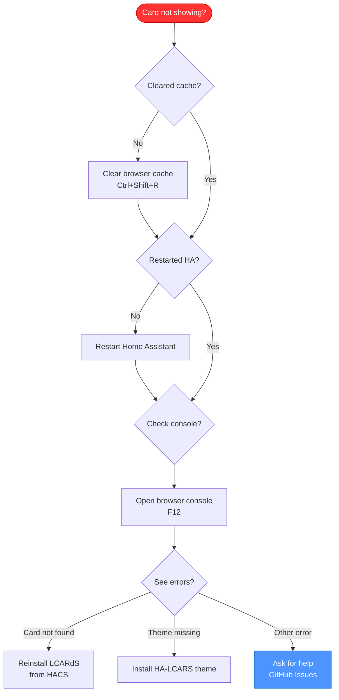
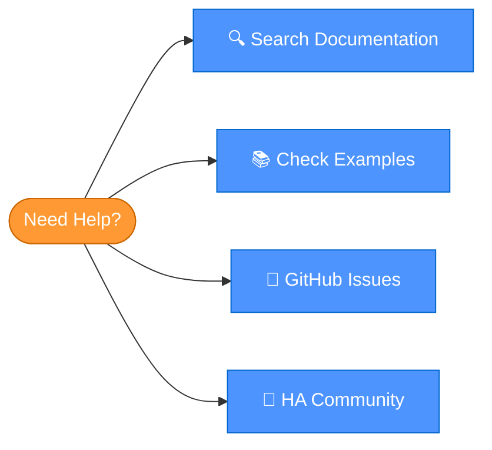

# Quick Start Guide

> **Get your LCARS interface up and running in 5 minutes!**
> This guide will walk you through the fastest path to your first LCARdS card.

---

## 🚀 5-Minute Startup Sequence


---

## Prerequisites

Before starting, make sure you have:
- ✅ Home Assistant running (2023.1 or newer recommended)
- ✅ HACS installed and configured
- ✅ Admin access to your Home Assistant instance

---

## Step 1: Install Dependencies (2 minutes)

LCARdS requires a few other custom cards to work properly.

### Required HACS Cards



**Quick Install:**

1. Open HACS → Frontend
2. Search and install:
   - `HA-LCARS` (theme)
   - `my-slider-v2`
   - `lovelace-card-mod`
3. Restart Home Assistant when prompted

> 💡 **Tip:** Need detailed instructions? See the [Installation Guide](installation.md).

---

## Step 2: Setup Theme (1 minute)

### Apply the LCARS Theme

1. Go to **Settings → Themes**
2. Find `LCARS Picard [cb-lcars]` (or any LCARS theme)
3. Set as your active theme

### Add Antonio Font (recommended)

Add this to your Home Assistant configuration:

```yaml
# configuration.yaml
frontend:
  themes: !include_dir_merge_named themes
  extra_module_url:
    - https://fonts.googleapis.com/css2?family=Antonio:wght@100..700&display=swap
```

> 📝 **Note:** LCARdS will load the font automatically if it's missing, but adding it yourself is faster.

---

## Step 3: Install LCARdS (1 minute)

### Add Repository & Install

[](https://my.home-assistant.io/redirect/hacs_repository/?owner=snootched&repository=cb-lcars)

**Manual Steps:**
1. Open HACS → Frontend
2. Click ⋮ (menu) → Custom repositories
3. Add: `https://github.com/snootched/cb-lcars`
4. Category: `Lovelace`
5. Click **Add**
6. Find "LCARdS" in HACS
7. Click **Download**
8. Restart Home Assistant

---

## Step 4: Add Your First Card (1 minute)

Let's create a simple header card to verify everything works!

### Quick Test Card


**Copy-Paste Example:**

```yaml
type: custom:lcards-button
preset: lozenge
text:
  label:
    content: "USS ENTERPRISE"
  name:
    content: "NCC-1701-D"
    position: top-left
style:
  card:
    color:
      background:
        active: 'var(--lcars-blue)'
```

**Expected Result:**

A blue LCARS button with "USS ENTERPRISE" as the main label and "NCC-1701-D" in the top-left corner.

> 🎉 **Success!** You should see a blue LCARS button with your text.

---

## What's Next?

Now that LCARdS is working, explore these guides:

### Next Steps Flow



### Recommended Learning Path

1. **[First Card Tutorial](first-card.md)** - Create a complete LCARS interface (10 minutes)
2. **[Overlay System Guide](../configuration/overlays/README.md)** - Add dynamic elements
3. **[DataSource Guide](../configuration/datasources.md)** - Connect to Home Assistant entities
4. **[Example Gallery](../examples/)** - Browse copy-paste configurations

---

## Troubleshooting

### Card Doesn't Appear



**Quick Fixes:**
- ✅ Clear browser cache (Ctrl+Shift+R or Cmd+Shift+R)
- ✅ Restart Home Assistant
- ✅ Check all dependencies are installed
- ✅ Verify LCARS theme is active
- ✅ Check browser console (F12) for errors

### Common Issues

| Problem | Solution |
|---------|----------|
| "Custom element doesn't exist" | Clear cache + restart HA |
| Wrong fonts | Add Antonio font resource |
| Colors don't match screenshots | Activate `LCARS Picard [cb-lcars]` theme |
| Card configuration invalid | Check YAML indentation |

---

## Getting Help



### Resources

- **[Documentation](../../README.md)** - Complete user guide
- **[GitHub Issues](https://github.com/snootched/cb-lcars/issues)** - Report bugs or ask questions
- **[Home Assistant Community](https://community.home-assistant.io/)** - General HA help
- **[Example Configs](../examples/)** - Working configurations to learn from

---

## Summary

**You did it!** 🎉

In just 5 minutes, you:
- ✅ Installed all dependencies
- ✅ Setup the LCARS theme
- ✅ Installed LCARdS
- ✅ Created your first card

**Ready for more?** Continue to the [First Card Tutorial](first-card.md) to build a complete LCARS interface!

---

**Navigation:**
- 📖 Next: [First Card Tutorial](first-card.md)
- 🏠 [Documentation Home](../../README.md)
- 🔧 [Installation Details](installation.md)
