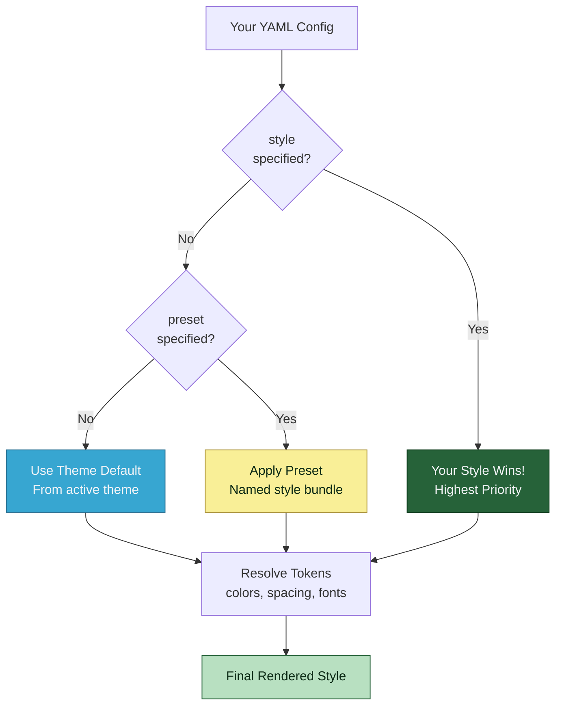
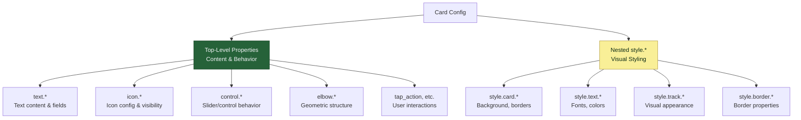

# MSD Configuration Layering Reference

> **Configuration flow from themes to final values**
> Understanding priority, themes, presets, and style resolution

## Overview

This document explains how configuration flows through the MSD system, from themes to final resolved values.

---

## Configuration Priority

Understanding how your styles are applied:



**Priority Order (Highest to Lowest):**
1. 🥇 **Your style** - Direct `style:` properties in overlay config
2. 🥈 **Style presets** - Named presets like `lcars_button_preset: "lozenge"`
3. 🥉 **Theme defaults** - Component defaults from active theme (e.g., `lcars-classic`)
4. 🎨 **Built-in fallbacks** - System defaults if nothing else specified

**Example:**
```yaml
overlays:
  - id: my_button
    type: button
    style:
      lcars_button_preset: "lozenge"  # 2. Apply preset
      color: "#ff6600"                # 1. Your override wins!
      # fontSize not specified         # 3. Uses theme default
```

**Result:** Color is `#ff6600` (your override), other styles from preset, any missing use theme defaults.

---

## Config Architecture Pattern

LCARdS uses a clear architectural pattern to separate **what to show** from **how it looks**:

### The Pattern



### Top-Level Properties (Content/Behavior)

These define **what to display** and **how it behaves**:

| Property | Purpose | Example |
|----------|---------|---------|
| `text.*` | Text content and positioning | `text.label.content: "Kitchen"` |
| `icon.*` | Icon configuration | `icon.icon: "mdi:lightbulb"` |
| `control.*` | Control behavior (sliders) | `control.min: 0, control.max: 100` |
| `elbow.*` | Geometric structure (elbows) | `elbow.segment.bar_width: 40` |
| `tap_action`, `hold_action` | User interactions | `tap_action.action: toggle` |
| `entity` | Entity binding | `entity: light.kitchen` |

### Nested style.* Properties (Visual Styling)

These define **how it looks**:

| Property | Purpose | Example |
|----------|---------|---------|
| `style.card.*` | Card appearance | `style.card.color.background: "#ff6600"` |
| `style.text.*` | Text styling | `style.text.default.font_size: 16` |
| `style.track.*` | Track appearance (sliders) | `style.track.type: "segments"` |
| `style.border.*` | Border styling | `style.border.width: 2` |

### Example: Button Card

```yaml
type: custom:lcards-button
entity: light.kitchen              # ← Top-level (behavior)

text:                               # ← Top-level (content)
  label:
    content: "Kitchen Light"        # What to show
    position: left                  # Where to show it

icon:                               # ← Top-level (content)
  icon: "mdi:lightbulb"            # Which icon
  show: true                        # Whether to show

tap_action:                         # ← Top-level (behavior)
  action: toggle                    # What happens on tap

style:                              # ← Nested (visual styling)
  card:
    color:
      background:
        active: "#ff6600"           # How it looks when active
  text:
    default:
      font_size: 16                 # Font styling
      color:
        active: "#ffffff"
```

### Rules and This Pattern

When writing rules, you patch **top-level properties** (both content and style):

```yaml
rules:
  - id: light_on_rule
    when:
      entity: light.kitchen
      state: "on"
    apply:
      overlays:
        kitchen_button:
          text:                     # ✅ Correct: top-level text config
            label:
              content: "LIGHT ON"
          style:                    # ✅ Correct: top-level style config
            card:
              color:
                background: "#00ff00"
```

**Common mistake:**
```yaml
apply:
  overlays:
    kitchen_button:
      styles.text.*               # ❌ WRONG: No "styles" property exists
```

**Why this pattern?**
- ✅ Clear separation of concerns
- ✅ Content decisions separate from visual decisions
- ✅ Easier to maintain and understand
- ✅ Consistent with Lit/web component best practices

---

## 1. Configuration Sources & Priority

The MSD system uses a **unified theme-based approach** with clear priority ordering:

```
┌─────────────────────────────────────────────────────────────┐
│                   FINAL RESOLVED VALUES                     │
│                    (what gets rendered)                     │
└─────────────────────────────────────────────────────────────┘
                            ▲
                            │
┌─────────────────────────────────────────────────────────────┐
│ 5. STYLE RESOLUTION (in Renderer._resolveStyles)           │
│    • Uses ThemeManager.getDefault() for component defaults │
│    • Applies style presets via preset system               │
│    • Smart calculations (token resolution, etc.)           │
└─────────────────────────────────────────────────────────────┘
                            ▲
                            │
┌─────────────────────────────────────────────────────────────┐
│ 4. USER STYLE CONFIGURATION (highest priority)             │
│    • Direct style properties in overlay.style              │
│    • User-specified values override everything             │
└─────────────────────────────────────────────────────────────┘
                            ▲
                            │
┌─────────────────────────────────────────────────────────────┐
│ 3. STYLE PRESETS (named style bundles)                     │
│    • LCARdS button presets (lozenge, bullet, etc.)      │
│    • Complete style configurations                          │
│    • Applied via lcars_button_preset: "preset_name"        │
└─────────────────────────────────────────────────────────────┘
                            ▲
                            │
┌─────────────────────────────────────────────────────────────┐
│ 2. THEME SYSTEM (ThemeManager)                             │
│    ┌─ Active Theme (e.g., lcars-classic) ─────────────────┐│
│    │   • Component defaults from theme tokens            ││
│    │   • text.defaultSize: 'typography.fontSize.base'    ││
│    │   • statusGrid.textPadding: 'spacing.scale.4'       ││
│    │   • Token resolution (colors, spacing, typography)  ││
│    └─────────────────────────────────────────────────────┘│
└─────────────────────────────────────────────────────────────┘
                            ▲
                            │
┌─────────────────────────────────────────────────────────────┐
│ 1. PACK LOADING & THEME SELECTION (mergePacks.js)          │
│    • Loads builtin_themes pack (always)                    │
│    • Loads other packs (core, lcards_buttons, etc.)      │
│    • Loads user-selected theme or default theme            │
│    • Registers style presets from packs                    │
└─────────────────────────────────────────────────────────────┘
                            ▲
                            │
┌─────────────────────────────────────────────────────────────┐
│ 0. RAW USER CONFIGURATION                                  │
│    • YAML config from user                                 │
│    • Specifies which theme to use                          │
│    • Specifies which packs to load                         │
└─────────────────────────────────────────────────────────────┘
```

## 2. Detailed Flow

### Step 0: User Configuration
```yaml
# User config specifies theme and packs
msd:
  theme: "lcars-classic"          # Select active theme
  use_packs:
    builtin: ['core', 'lcards_buttons']
  overlays:
    - id: my_grid
      type: status_grid
      style:
        lcars_button_preset: "lozenge"  # Apply preset
        cell_color: "#ff6600"            # User override
```

### Step 1: Pack Loading & Theme Initialization (mergePacks.js + SystemsManager.js)
```javascript
// mergePacks.js loads all specified packs + builtin_themes (always)
const packsToLoad = [...userPacks, 'builtin_themes'];
const packs = loadBuiltinPacks(packsToLoad);

// SystemsManager initializes ThemeManager with loaded packs
await this.themeManager.initialize(packs, requestedTheme, mountEl);

// ThemeManager loads the active theme's tokens
const theme = packs.find(p => p.id === 'builtin_themes').themes[requestedTheme];
this.activeTheme = theme;
this.tokens = theme.tokens; // lcarsClassicTokens
```

### Step 2: Theme Token Structure
```javascript
// Theme tokens contain component defaults
lcarsClassicTokens = {
  colors: {
    accent: { primary: 'var(--lcars-orange)' },
    status: { success: 'var(--lcars-green)' }
  },
  typography: {
    fontSize: { base: 16 },
    fontFamily: { primary: 'Antonio' }
  },
  spacing: {
    scale: { '4': 8 },
    gap: { base: 4 }
  },
  components: {
    text: {
      defaultSize: 'typography.fontSize.base',   // Token reference
      defaultColor: 'colors.ui.foreground',       // Token reference
      bracket: {
        width: 'borders.width.base',              // Token reference
        gap: 'spacing.gap.base',                  // Token reference
        extension: 8                               // Direct value
      }
    },
    statusGrid: {
      rows: 3,
      columns: 4,
      cellGap: 'spacing.gap.sm',
      textPadding: 'spacing.scale.4',
      statusOnColor: 'colors.status.success'
    }
  }
}
```

### Step 3: Style Resolution in Renderers
```javascript
// StatusGridRenderer.js
_resolveStatusGridStyles(style, overlayId) {
  // 1. Get component defaults from ThemeManager
  const defaultRows = this._getDefault('statusGrid.rows', 3);
  const defaultCellGap = this._getDefault('statusGrid.cellGap', 2);
  const defaultTextPadding = this._getDefault('statusGrid.textPadding', 8);

  // ThemeManager resolves:
  // 'statusGrid.rows' → 3 (direct value from theme)
  // 'statusGrid.cellGap' → 'spacing.gap.sm' → 2 (token resolution)
  // 'statusGrid.textPadding' → 'spacing.scale.4' → 8 (token resolution)

  // 2. Apply style preset if specified
  if (style.lcars_button_preset) {
    const preset = stylePresetManager.getPreset('status_grid', style.lcars_button_preset);
    // Preset may override theme defaults
  }

  // 3. Apply user style values (highest priority)
  const finalCellGap = style.cell_gap || presetCellGap || defaultCellGap;
}
```

### Step 4: ThemeManager Resolution
```javascript
// ThemeManager.getDefault(componentType, property, fallback)
getDefault(componentType, property, fallback) {
  // 1. Build full path: components.statusGrid.cellGap
  const fullPath = `components.${componentType}.${property}`;

  // 2. Look up in active theme tokens
  const value = this._resolvePath(this.tokens, fullPath);

  // 3. If value is a token reference, resolve it
  if (this._isTokenReference(value)) {
    return this._resolveTokenReference(value);
    // 'spacing.gap.sm' → tokens.spacing.gap.sm → 2
  }

  // 4. Return resolved value or fallback
  return value !== undefined ? value : fallback;
}
```

## 3. Style Presets System

Style presets provide **named style bundles** independent of themes:

```javascript
// Pack definition (lcards_buttons pack)
style_presets: {
  status_grid: {
    lozenge: {
      text_layout: 'diagonal',
      label_position: 'top-left',
      value_position: 'bottom-right',
      cell_radius: 34,
      text_padding: 14,
      normalize_radius: false
    }
  }
}

// User applies preset
style: {
  lcars_button_preset: "lozenge",  // Loads all lozenge properties
  cell_color: "#ff6600"            // User override
}
```

### Preset vs Theme vs User Values

```yaml
# Theme provides defaults:
components.statusGrid.textPadding: 'spacing.scale.4' → 8

# Preset overrides theme:
lozenge: { text_padding: 14 }

# User overrides everything:
style:
  lcars_button_preset: "lozenge"  # Loads preset (text_padding: 14)
  text_padding: 20                # USER WINS: final value is 20
```

## 4. Priority Summary

From **highest to lowest priority**:

1. **User Style Properties** - Direct `style.text_padding` values (highest)
2. **Style Preset Values** - `lcars_button_preset: "lozenge"` properties
3. **Theme Component Defaults** - `components.statusGrid.textPadding` in theme
4. **Hardcoded Fallbacks** - Last resort values in code (lowest)

**Note:** The old system had 7 layers (profiles, pack layer, theme layer, etc.).
The new system has **4 clear layers** with themes providing all defaults.

## 5. Theme Token Resolution

Themes support **token references** for consistency:

```javascript
// Theme tokens
{
  spacing: {
    scale: { '4': 8 }
  },
  components: {
    statusGrid: {
      textPadding: 'spacing.scale.4'  // Token reference
    }
  }
}

// Resolution
ThemeManager.getDefault('statusGrid', 'textPadding', 8)
// → Looks up 'components.statusGrid.textPadding'
// → Finds 'spacing.scale.4'
// → Resolves to 8
// → Returns 8
```

### Supported Token Categories:
- `colors.*` - Color palette
- `typography.*` - Font settings
- `spacing.*` - Spacing scales
- `borders.*` - Border properties
- `effects.*` - Visual effects
- `components.*` - Component defaults

## 6. Migration from Old System

### Old System (Deprecated):
```yaml
profiles:
  - id: cb_button_defaults
    defaults:
      status_grid:
        text_padding: 12  # Pack-level default
```

### New System (Current):
```javascript
// Theme tokens
lcarsClassicTokens = {
  components: {
    statusGrid: {
      textPadding: 'spacing.scale.4'  // Theme-level default
    }
  }
}
```

**Benefits:**
- ✅ **Simpler** - Only 4 layers instead of 7
- ✅ **More powerful** - Token resolution and computed values
- ✅ **Better organized** - All defaults in theme files
- ✅ **Easier to maintain** - No profile system complexity

## 7. Debug Commands

```javascript
// Check active theme
const themeManager = window.lcards.theme;
console.log('Active theme:', themeManager.getActiveTheme());

// Check theme tokens
console.log('Theme tokens:', themeManager.tokens);

// Check component default
console.log('StatusGrid textPadding:',
  themeManager.getDefault('statusGrid', 'textPadding', 8)
);

// List available themes
console.log('Available themes:', themeManager.listThemes());

// Check renderer connection
const renderer = new window.StatusGridRenderer();
console.log('Renderer gets:',
  renderer._getDefault('statusGrid.textPadding', 8)
);
```

## 8. Creating Custom Themes

Users can create custom themes in their packs:

```yaml
# User's custom pack
msd:
  use_packs:
    external:
      - url: "/local/my-custom-theme-pack.json"

# my-custom-theme-pack.json
{
  "id": "my_themes",
  "themes": {
    "my-custom-theme": {
      "id": "my-custom-theme",
      "name": "My Custom Theme",
      "tokens": {
        "colors": {
          "accent": { "primary": "#00ff00" }
        },
        "components": {
          "statusGrid": {
            "cellGap": 4,
            "textPadding": 12
          }
        }
      }
    }
  }
}

# Select custom theme
msd:
  theme: "my-custom-theme"
```

This unified theme system provides **maximum flexibility** while maintaining **predictable behavior** - themes provide defaults, presets provide styled combinations, and users can override anything.

---

## See Also

- [Theme Creation Tutorial](./theme_creation_tutorial.md) - Create custom themes
- [Style Priority Reference](./style-priority.md) - Style resolution order
- [Token Reference Card](./token_reference_card.md) - All theme tokens

---

[← Back to Reference](../README.md) | [User Guide →](../../README.md)