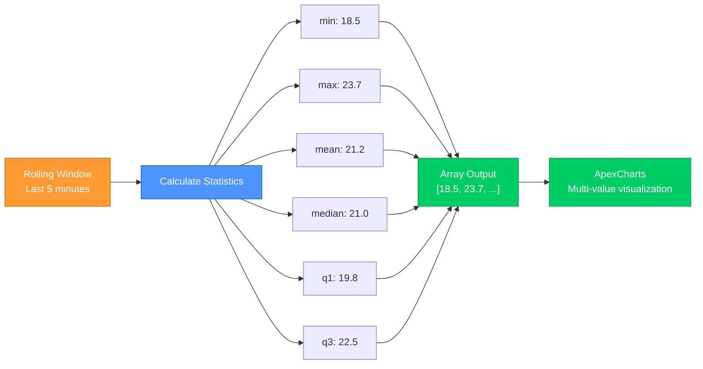
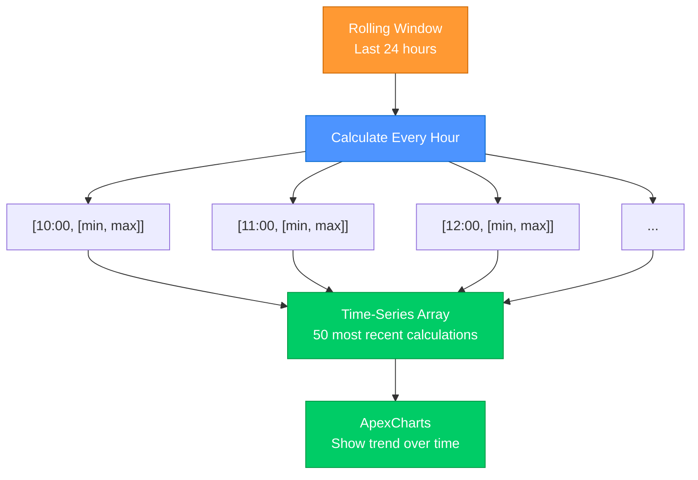

# DataSource Aggregations Reference

> **Analyze time-windowed data with statistical operations**
> Moving averages, min/max tracking, rate calculations, trend detection, and rolling statistics

## Overview

Aggregations analyze data over time windows, providing statistical measures, trends, and insights from historical data. Unlike transformations that process individual values, aggregations operate on data buffers to derive meaningful patterns.

**Key Features:**
- ✅ Time-windowed analysis (5m, 1h, 24h, etc.)
- ✅ Moving averages with configurable windows
- ✅ Min/max/average statistical tracking
- ✅ Rate of change calculations
- ✅ Trend detection (increasing/decreasing/stable)
- ✅ Duration tracking for condition monitoring
- ✅ Session-based statistics
- ✅ Multi-value rolling statistics for advanced charts
- ✅ Time-series rolling statistics for trend visualization
- ✅ Automatic buffer management

---

## Table of Contents

1. [Aggregation Basics](#aggregation-basics)
2. [Moving Average](#moving-average)
3. [Min/Max Statistics](#minmax-statistics)
4. [Rate of Change](#rate-of-change)
5. [Session Statistics](#session-statistics)
6. [Recent Trend](#recent-trend)
7. [Duration Tracking](#duration-tracking)
8. [Rolling Statistics](#rolling-statistics)
9. [Rolling Statistics Series](#rolling-statistics-series-time-series)
10. [Time Windows](#time-windows)
11. [Examples](#examples)

---

## Aggregation Basics

### How Aggregations Work

```
Historical Buffer → Aggregation Processor → Statistical Result
[v1, v2, v3, ...]        (analyze)         {avg: X, min: Y, ...}
```

Aggregations:
- Operate on buffered historical data
- Update with each new data point
- Produce structured result objects
- Store results with unique keys
- Are accessible via dot notation

### Basic Syntax

```yaml
data_sources:
  sensor_name:
    type: entity
    entity: sensor.entity_id
    windowSeconds: 300          # 5 minute buffer
    aggregations:
      <aggregation_type>:
        # ... aggregation-specific properties
        key: <result_name>
```

### Accessing Results

```yaml
overlays:
  - content: "Raw: {sensor_name.value}"
  - content: "Avg: {sensor_name.aggregations.result_name.avg}"
  - content: "Min: {sensor_name.aggregations.result_name.min}"
```

### Buffer Requirements

Aggregations require sufficient historical data:
- **Minimum**: 2-3 data points for basic calculations
- **Recommended**: 10+ points for stable statistics
- **Window size**: Set `windowSeconds` ≥ aggregation window

---

## 📊 Moving Average

Calculate rolling averages over time windows.

### Basic Usage

```yaml
aggregations:
  moving_average:
    window: "5m"               # Time window
    key: "avg_5m"
```

### Properties

| Property | Type | Required | Default | Description |
|----------|------|----------|---------|-------------|
| `window` | string | ✅ | - | Time window (e.g., "5m", "1h") |
| `max_samples` | number | ❌ | unlimited | Maximum sample count |
| `key` | string | ❌ | `"moving_average"` | Result key name |

### Result Structure

```javascript
{
  value: 23.4,                  // Moving average value
  samples: 30,                  // Number of samples in window
  window: "5m",                 // Time window
  oldest: 1698345600000,        // Oldest sample timestamp
  newest: 1698345900000         // Newest sample timestamp
}
```

### Examples

**Simple 5-minute average:**
```yaml
aggregations:
  moving_average:
    window: "5m"
    key: "avg_5m"
```

**Multiple time windows:**
```yaml
aggregations:
  short_avg:
    window: "5m"
    key: "avg_5m"

  medium_avg:
    window: "30m"
    key: "avg_30m"

  long_avg:
    window: "6h"
    key: "avg_6h"
```

**Sample-limited average:**
```yaml
aggregations:
  moving_average:
    window: "1h"
    max_samples: 100           # Limit to 100 most recent samples
    key: "avg_1h"
```

### Use Cases

- **Smoothing noisy sensors**: Temperature, humidity, pressure
- **Power monitoring**: Average consumption over time
- **Network analysis**: Average bandwidth, latency
- **Comparing timeframes**: Short vs. long-term trends

---

## 📈 Min/Max Statistics

Track minimum, maximum, and average values over time windows.

### Basic Usage

```yaml
aggregations:
  min_max:
    min: true
    max: true
    avg: true
    window: "24h"              # Optional time window
    key: "daily_stats"
```

### Properties

| Property | Type | Required | Default | Description |
|----------|------|----------|---------|-------------|
| `min` | boolean | ❌ | `true` | Track minimum value |
| `max` | boolean | ❌ | `true` | Track maximum value |
| `avg` | boolean | ❌ | `true` | Track average value |
| `window` | string | ❌ | session | Time window (omit for session) |
| `key` | string | ❌ | `"min_max"` | Result key name |

### Result Structure

```javascript
{
  min: 15.2,                    // Minimum value in window
  max: 28.7,                    // Maximum value in window
  avg: 22.1,                    // Average value in window
  samples: 144,                 // Number of samples
  minTimestamp: 1698302400000,  // When minimum occurred
  maxTimestamp: 1698334800000,  // When maximum occurred
  window: "24h"                 // Time window (or "session")
}
```

### Examples

**Daily temperature range:**
```yaml
aggregations:
  min_max:
    min: true
    max: true
    avg: true
    window: "24h"
    key: "daily"
```

**Session-based statistics (no window):**
```yaml
aggregations:
  min_max:
    min: true
    max: true
    avg: true
    key: "session_stats"
```

**Track only max (for peak detection):**
```yaml
aggregations:
  min_max:
    min: false
    max: true
    avg: false
    window: "1h"
    key: "peak_1h"
```

### Use Cases

- **Daily summaries**: Temperature range, humidity extremes
- **Peak tracking**: Maximum power consumption, traffic spikes
- **Capacity planning**: Average load, peak usage
- **Performance monitoring**: Response time min/max/avg

---

## 📉 Rate of Change

Calculate how fast values are changing over time.

### Basic Usage

```yaml
aggregations:
  rate_of_change:
    unit: "per_minute"
    smoothing: true
    key: "rate"
```

### Properties

| Property | Type | Required | Default | Description |
|----------|------|----------|---------|-------------|
| `unit` | string | ✅ | - | Rate unit: `per_second`, `per_minute`, `per_hour` |
| `smoothing` | boolean | ❌ | `false` | Apply smoothing to rate |
| `key` | string | ❌ | `"rate_of_change"` | Result key name |

### Result Structure

```javascript
{
  rate: 1.2,                    // Rate of change value
  unit: "per_minute",           // Rate unit
  direction: "increasing",      // Direction: increasing, decreasing, stable
  absoluteRate: 1.2,            // Absolute value of rate
  previousValue: 45.3,          // Previous value
  currentValue: 46.5,           // Current value
  deltaTime: 60000              // Time difference (ms)
}
```

### Examples

**Power consumption rate:**
```yaml
data_sources:
  power_meter:
    type: entity
    entity: sensor.power_watts
    aggregations:
      rate_of_change:
        unit: "per_minute"
        smoothing: true
        key: "rate"
```

**Temperature change rate:**
```yaml
aggregations:
  rate_of_change:
    unit: "per_hour"
    smoothing: false           # Raw rate for fast detection
    key: "temp_rate"
```

**Multiple rate calculations:**
```yaml
aggregations:
  rate_per_sec:
    unit: "per_second"
    key: "rate_sec"

  rate_per_min:
    unit: "per_minute"
    key: "rate_min"

  rate_per_hour:
    unit: "per_hour"
    key: "rate_hour"
```

### Use Cases

- **Power monitoring**: Detecting rapid power increases
- **Temperature alerts**: Fast temperature changes
- **Battery monitoring**: Discharge/charge rate
- **Network analysis**: Bandwidth change rate
- **Predictive maintenance**: Abnormal rate changes

---

## 📋 Session Statistics

Track comprehensive statistics for the entire session (page load to now).

### Basic Usage

```yaml
aggregations:
  session_stats:
    key: "session"
```

### Properties

| Property | Type | Required | Default | Description |
|----------|------|----------|---------|-------------|
| `key` | string | ❌ | `"session_stats"` | Result key name |

### Result Structure

```javascript
{
  min: 18.2,                    // Minimum value in session
  max: 32.1,                    // Maximum value in session
  avg: 24.7,                    // Average value in session
  count: 1847,                  // Total sample count
  sum: 45623.9,                 // Sum of all values
  first: 22.3,                  // First value in session
  last: 24.8,                   // Last (current) value
  range: 13.9,                  // Range (max - min)
  startTime: 1698302400000,     // Session start timestamp
  lastUpdate: 1698345900000,    // Last update timestamp
  duration: 43500000            // Session duration (ms)
}
```

### Examples

**Simple session tracking:**
```yaml
aggregations:
  session_stats:
    key: "session"
```

**Multiple sensors with session stats:**
```yaml
data_sources:
  temperature:
    type: entity
    entity: sensor.temperature
    aggregations:
      session_stats:
        key: "temp_session"

  humidity:
    type: entity
    entity: sensor.humidity
    aggregations:
      session_stats:
        key: "humid_session"
```

### Use Cases

- **Session summaries**: Overall performance since page load
- **Comparison**: Current vs. session average
- **Dashboard metrics**: Total samples, duration, range
- **Performance tracking**: Session min/max/avg

---

## 📈 Recent Trend

Detect current trend direction (increasing, decreasing, stable) from recent samples.

### Basic Usage

```yaml
aggregations:
  recent_trend:
    samples: 5                 # Number of recent samples
    threshold: 0.01            # Significance threshold
    key: "trend"
```

### Properties

| Property | Type | Required | Default | Description |
|----------|------|----------|---------|-------------|
| `samples` | number | ❌ | `5` | Number of recent samples |
| `threshold` | number | ❌ | `0.01` | Minimum slope for trend |
| `key` | string | ❌ | `"recent_trend"` | Result key name |

### Result Structure

```javascript
{
  direction: "increasing",      // Direction: increasing, decreasing, stable
  strength: 0.045,              // Magnitude of trend (absolute)
  slope: 0.045,                 // Raw slope value (can be negative)
  samples: 5,                   // Number of samples analyzed
  confidence: 0.87              // Trend confidence (0-1)
}
```

### Direction Values

- **`"increasing"`**: Values trending upward (slope > threshold)
- **`"decreasing"`**: Values trending downward (slope < -threshold)
- **`"stable"`**: No significant trend (|slope| ≤ threshold)

### Examples

**Basic trend detection:**
```yaml
aggregations:
  recent_trend:
    samples: 5
    threshold: 0.01
    key: "trend"
```

**Sensitive trend detection:**
```yaml
aggregations:
  recent_trend:
    samples: 10                # More samples = smoother
    threshold: 0.001           # Lower threshold = more sensitive
    key: "sensitive_trend"
```

**Fast trend detection:**
```yaml
aggregations:
  recent_trend:
    samples: 3                 # Fewer samples = faster response
    threshold: 0.05            # Higher threshold = less sensitive
    key: "fast_trend"
```

**Temperature trend example:**
```yaml
data_sources:
  outdoor_temp:
    type: entity
    entity: sensor.temperature
    aggregations:
      recent_trend:
        samples: 10
        threshold: 0.05        # 0.05°C/sample
        key: "temp_trend"
```

### Use Cases

- **Alerts**: Trigger when value starts increasing/decreasing
- **Visual indicators**: Show trend arrows on dashboards
- **Predictive**: Early warning of changes
- **Automation**: Adjust based on trend direction

---

## ⏱️ Duration Tracking

Track how long values maintain specific conditions.

### Basic Usage

```yaml
aggregations:
  duration:
    condition: "above"
    threshold: 25
    units: "minutes"
    key: "high_duration"
```

### Properties

| Property | Type | Required | Description |
|----------|------|----------|-------------|
| `condition` | string | ✅ | Condition type: `above`, `below`, `equals`, `range` |
| `threshold` | number | ❌* | Threshold value (for above/below/equals) |
| `range` | [number, number] | ❌* | Range [min, max] (for range condition) |
| `units` | string | ✅ | Time units: `seconds`, `minutes`, `hours` |
| `key` | string | ❌ | Result key name (default: `"duration"`) |

\* Either `threshold` (for above/below/equals) or `range` (for range) is required

### Result Structure

```javascript
{
  current: 12.5,                // Current streak duration
  total: 45.3,                  // Total duration in session
  longest: 23.1,                // Longest streak recorded
  count: 3,                     // Number of times condition met
  isActive: true,               // Whether condition currently met
  units: "minutes",             // Unit of measurement
  condition: "above",           // Condition being tracked
  threshold: 25                 // Threshold value (if applicable)
}
```

### Condition Types

**Above threshold:**
```yaml
aggregations:
  duration:
    condition: "above"
    threshold: 30
    units: "minutes"
    key: "high_temp_duration"
```

**Below threshold:**
```yaml
aggregations:
  duration:
    condition: "below"
    threshold: 20
    units: "hours"
    key: "low_battery_duration"
```

**Equals value:**
```yaml
aggregations:
  duration:
    condition: "equals"
    threshold: 0               # Track time at zero
    units: "seconds"
    key: "zero_duration"
```

**In range (comfort zone):**
```yaml
aggregations:
  duration:
    condition: "range"
    range: [20, 25]            # Between 20-25°C
    units: "hours"
    key: "comfort_duration"
```

### Examples

**High temperature tracking:**
```yaml
data_sources:
  temperature:
    type: entity
    entity: sensor.outdoor_temp
    aggregations:
      duration:
        condition: "above"
        threshold: 30
        units: "hours"
        key: "hot_duration"
```

**Comfort zone monitoring:**
```yaml
aggregations:
  comfort_duration:
    condition: "range"
    range: [20, 24]
    units: "hours"
    key: "comfort_time"

  too_cold_duration:
    condition: "below"
    threshold: 20
    units: "hours"
    key: "cold_time"

  too_hot_duration:
    condition: "above"
    threshold: 24
    units: "hours"
    key: "hot_time"
```

**Binary state tracking:**
```yaml
data_sources:
  motion_sensor:
    type: entity
    entity: binary_sensor.motion
    aggregations:
      duration:
        condition: "equals"
        threshold: 1           # 1 = on/detected
        units: "minutes"
        key: "motion_duration"
```

### Use Cases

- **Compliance monitoring**: Track time in acceptable range
- **Energy management**: Track high usage duration
- **Comfort tracking**: Time in comfort zone
- **Alert fatigue reduction**: Only alert after X duration
- **Usage statistics**: How long devices are on/off

---

## 📊 Rolling Statistics

> ⭐ **NEW FEATURE** - Calculate multiple statistical measures over rolling time windows for advanced visualizations

Calculate comprehensive statistical analysis over time windows, producing **multi-value arrays** perfect for advanced chart types like rangeArea, candlestick, and boxPlot charts.

### Overview

Unlike other aggregations that produce single values, `rolling_statistics` calculates **multiple statistics simultaneously** and outputs them as an array. This enables sophisticated visualizations:

- **Range charts** - Display min/max confidence intervals
- **OHLC charts** - Financial-style candlestick visualization
- **Distribution charts** - Box-and-whisker statistical plots



### Basic Usage

```yaml
aggregations:
  rolling_statistics:
    window: "5m"                    # Time window for analysis
    stats: [min, max]              # Statistics to calculate
    output_format: array           # Output as array for charts
    key: "temp_range"
```

### Properties

| Property | Type | Required | Default | Description |
|----------|------|----------|---------|-------------|
| `window` | string | Yes | - | Time window (e.g., "5m", "1h") |
| `stats` | array | Yes | - | Statistics to calculate (see below) |
| `output_format` | string | No | `"array"` | `"array"` or `"object"` |
| `input_source` | string | No | - | Chain from transformation output |
| `key` | string | Yes | - | Result key for access |

### Available Statistics

rolling_statistics supports **12 different statistical measures**:

#### Basic Statistics
- **`min`** - Minimum value in window
- **`max`** - Maximum value in window
- **`mean`** - Arithmetic average
- **`variance`** - Statistical variance
- **`std_dev`** - Standard deviation

#### Distribution Statistics (Quartiles)
- **`q1`** - First quartile (25th percentile)
- **`median`** - Median value (50th percentile)
- **`q3`** - Third quartile (75th percentile)

#### Time-Series Statistics (OHLC)
- **`open`** - First value in window
- **`close`** - Last value in window
- **`high`** - Highest value (same as max)
- **`low`** - Lowest value (same as min)

### Output Formats

#### Array Format (for charts)

Best for ApexCharts multi-value visualization:

```yaml
aggregations:
  rolling_statistics:
    window: "5m"
    stats: [min, max]
    output_format: array          # Outputs [18.5, 23.7]
    key: "range"
```

**Result structure:**
```javascript
{
  value: [18.5, 23.7],           // Array in stats order
  timestamp: 1698765432000
}
```

#### Object Format (for text display)

Best for accessing individual stats:

```yaml
aggregations:
  rolling_statistics:
    window: "5m"
    stats: [min, max, mean]
    output_format: object         # Outputs {min: 18.5, max: 23.7, mean: 21.2}
    key: "stats"
```

**Result structure:**
```javascript
{
  value: {
    min: 18.5,
    max: 23.7,
    mean: 21.2
  },
  timestamp: 1698765432000
}
```

### Chart Type Examples

#### RangeArea Chart (Min/Max Range)

Display data range as a shaded area:

```yaml
data_sources:
  temperature:
    entity: sensor.outdoor_temperature
    windowSeconds: 3600
    aggregations:
      rolling_statistics:
        window: "5m"
        stats: [min, max]          # Two values for range
        output_format: array
        key: "temp_range"

overlays:
  - type: apexchart
    source: temperature.aggregations.temp_range
    position: [50, 50]
    size: [600, 300]
    style:
      chart_type: rangeArea        # Displays min-max range
      color: "var(--lcars-orange)"
      time_window: "1h"
```

**Result:** Shaded area chart showing temperature fluctuation range over time.

#### Candlestick Chart (OHLC Data)

Financial-style candlestick visualization:

```yaml
data_sources:
  power_usage:
    entity: sensor.power_meter
    windowSeconds: 86400           # 24 hours
    aggregations:
      rolling_statistics:
        window: "15m"              # 15-minute candles
        stats: [open, high, low, close]  # OHLC format
        output_format: array
        key: "power_ohlc"

overlays:
  - type: apexchart
    source: power_usage.aggregations.power_ohlc
    position: [50, 50]
    size: [800, 400]
    style:
      chart_type: candlestick      # OHLC candlesticks
      time_window: "24h"
      colors:
        upward: "var(--lcars-green)"
        downward: "var(--lcars-red)"
```

**Result:** Candlestick chart showing power usage patterns with green (increasing) and red (decreasing) candles.

#### BoxPlot Chart (Distribution Analysis)

Statistical distribution with quartiles:

```yaml
data_sources:
  response_time:
    entity: sensor.api_response_time
    windowSeconds: 3600
    aggregations:
      rolling_statistics:
        window: "5m"
        stats: [min, q1, median, q3, max]  # Five-number summary
        output_format: array
        key: "response_dist"

overlays:
  - type: apexchart
    source: response_time.aggregations.response_dist
    position: [50, 50]
    size: [700, 350]
    style:
      chart_type: boxPlot          # Box-and-whisker plot
      color: "var(--lcars-purple)"
      time_window: "1h"
```

**Result:** Box-and-whisker plots showing response time distribution over time.

### Advanced Features

#### Input Source Chaining

Chain from transformation output instead of raw values:

```yaml
data_sources:
  temperature:
    entity: sensor.temperature_raw
    windowSeconds: 3600
    transformations:
      - type: scale
        factor: 1.8
        offset: 32
        key: "fahrenheit"
    aggregations:
      rolling_statistics:
        window: "10m"
        stats: [min, max, mean]
        input_source: "fahrenheit"   # Use transformed values
        output_format: object
        key: "f_stats"

overlays:
  - type: text
    content: |
      Temperature Statistics (°F)
      Min: {temperature.aggregations.f_stats.min:.1f}°F
      Max: {temperature.aggregations.f_stats.max:.1f}°F
      Avg: {temperature.aggregations.f_stats.mean:.1f}°F
```

#### Multiple Statistics Sets

Calculate different stat sets for different purposes:

```yaml
data_sources:
  sensor_data:
    entity: sensor.measurement
    windowSeconds: 3600
    aggregations:
      # For range visualization
      rolling_statistics:
        window: "5m"
        stats: [min, max]
        output_format: array
        key: "range"

      # For statistical analysis
      rolling_statistics:
        window: "15m"
        stats: [mean, std_dev, variance]
        output_format: object
        key: "analysis"

      # For OHLC chart
      rolling_statistics:
        window: "1h"
        stats: [open, high, low, close]
        output_format: array
        key: "ohlc"
```

### Performance Considerations

#### Window Size Impact

```yaml
# FAST - Small window, frequent updates
rolling_statistics:
  window: "1m"                    # Only 1 minute of data
  stats: [min, max]               # 2 statistics

# MEDIUM - Balanced performance
rolling_statistics:
  window: "5m"                    # 5 minutes of data
  stats: [min, q1, median, q3, max]  # 5 statistics

# SLOWER - Large window, more stats
rolling_statistics:
  window: "1h"                    # 60 minutes of data
  stats: [min, max, mean, median, q1, q3, std_dev, variance]  # 8 statistics
```

**Guidelines:**
- Smaller windows = faster calculations
- Fewer statistics = better performance
- Chart updates happen on every new data point
- Consider your sensor's update frequency

#### Buffer Requirements

Ensure `windowSeconds` is **at least equal to** your largest stats window:

```yaml
data_sources:
  sensor:
    windowSeconds: 3600           # Must be ≥ largest stats window
    aggregations:
      rolling_statistics:
        window: "30m"             # ✅ OK: 30m < 3600s (1h)
        stats: [min, max]

      rolling_statistics:
        window: "2h"              # ❌ PROBLEM: 2h > 3600s (1h)
        stats: [min, max]         # Will only use 1h of data!
```

### Use Cases

#### Temperature Monitoring

Show temperature range and trends:

```yaml
data_sources:
  outdoor_temp:
    entity: sensor.outdoor_temperature
    windowSeconds: 3600
    aggregations:
      rolling_statistics:
        window: "10m"
        stats: [min, max, mean]
        output_format: object
        key: "stats"

overlays:
  - type: text
    content: |
      🌡️ Outdoor Temperature
      Current: {outdoor_temp.value:.1f}°C
      Range: {outdoor_temp.aggregations.stats.min:.1f}-{outdoor_temp.aggregations.stats.max:.1f}°C
      Average: {outdoor_temp.aggregations.stats.mean:.1f}°C
```

#### Energy Usage Analysis

Track power consumption patterns:

```yaml
data_sources:
  house_power:
    entity: sensor.house_power
    windowSeconds: 86400
    aggregations:
      rolling_statistics:
        window: "1h"
        stats: [open, high, low, close, mean]
        output_format: object
        key: "hourly"

overlays:
  - type: apexchart
    source: house_power.aggregations.hourly
    style:
      chart_type: candlestick
      time_window: "24h"
```

#### System Performance

Monitor API or system metrics:

```yaml
data_sources:
  api_latency:
    entity: sensor.api_response_time
    windowSeconds: 3600
    aggregations:
      rolling_statistics:
        window: "5m"
        stats: [min, q1, median, q3, max]
        output_format: array
        key: "distribution"

overlays:
  - type: apexchart
    source: api_latency.aggregations.distribution
    style:
      chart_type: boxPlot
      title: "API Response Time Distribution"
```

### Accessing Results

#### Array Format Access

```yaml
# Direct array access (for charts)
overlays:
  - type: apexchart
    source: sensor.aggregations.range  # Entire array passed to chart
```

#### Object Format Access

```yaml
# Individual stat access (for text/buttons)
overlays:
  - type: text
    content: "Min: {sensor.aggregations.stats.min:.1f}"
  - type: text
    content: "Max: {sensor.aggregations.stats.max:.1f}"
  - type: text
    content: "Avg: {sensor.aggregations.stats.mean:.1f}"
```

### Common Patterns

#### Pattern 1: Confidence Intervals

```yaml
aggregations:
  rolling_statistics:
    window: "15m"
    stats: [min, mean, max]
    output_format: object
    key: "confidence"

# Display: "21.2°C (18.5 - 23.7)"
content: "{temp.aggregations.confidence.mean:.1f}°C ({temp.aggregations.confidence.min:.1f} - {temp.aggregations.confidence.max:.1f})"
```

#### Pattern 2: Change Detection

```yaml
aggregations:
  rolling_statistics:
    window: "30m"
    stats: [open, close]
    output_format: object
    key: "change"

# Calculate change
computed_sources:
  temp_change:
    expression: "temperature.aggregations.change.close - temperature.aggregations.change.open"
```

#### Pattern 3: Statistical Quality Check

```yaml
aggregations:
  rolling_statistics:
    window: "1h"
    stats: [mean, std_dev]
    output_format: object
    key: "quality"

# Show data stability
content: "Avg: {sensor.aggregations.quality.mean:.1f} (σ={sensor.aggregations.quality.std_dev:.2f})"
```

### Troubleshooting

#### No Data in Chart

**Problem:** Chart renders but shows no data

**Causes:**
1. `output_format` must be `"array"` for charts
2. `windowSeconds` must be ≥ `window` parameter
3. Not enough data points in buffer yet

**Solution:**
```yaml
aggregations:
  rolling_statistics:
    window: "5m"
    stats: [min, max]
    output_format: array          # ✅ Must be "array" for charts
    key: "range"

# Ensure buffer is large enough
data_sources:
  sensor:
    windowSeconds: 600            # ✅ 10 minutes ≥ 5 minute window
```

#### Invalid Stat Names

**Problem:** Error about invalid statistic

**Solution:** Use exact names from the 12 supported statistics:
```yaml
stats: [min, max, mean]          # ✅ Correct
stats: [minimum, maximum, avg]   # ❌ Wrong - use min, max, mean
```

#### Array vs Object Confusion

**For Charts:** Use `output_format: array`
```yaml
overlays:
  - type: apexchart
    source: sensor.aggregations.range    # Array format
```

**For Text:** Use `output_format: object`
```yaml
overlays:
  - type: text
    content: "{sensor.aggregations.stats.min:.1f}"  # Object format
```

---

## 📈 Rolling Statistics Series (Time-Series)

> ⭐ **NEW FEATURE** - Store historical time-series of rolling statistics for charting trends over time

While `rolling_statistics` calculates stats over a single window and updates the result, `rolling_statistics_series` **stores historical calculations** as a time-series array, perfect for visualizing how statistics evolve over time.

### Overview

**Use `rolling_statistics` when you want:**
- Current min/max/average over a window
- Single up-to-date statistical snapshot
- Real-time monitoring displays

**Use `rolling_statistics_series` when you want:**
- Historical trend of statistics over time
- ApexCharts rangeArea showing confidence intervals evolving
- Time-series of daily/hourly ranges for comparison
- Chart data that updates periodically



### Basic Usage

```yaml
aggregations:
  rolling_statistics_series:
    window: "24h"                  # Window for each calculation
    interval: "1h"                 # Calculate every hour
    stats: [min, max]              # Statistics to calculate
    output_format: array           # Output format
    max_points: 50                 # Keep last 50 calculations
    key: "temp_range_history"
```

### Properties

| Property | Type | Required | Default | Description |
|----------|------|----------|---------|-------------|
| `window` | string | Yes | - | Time window for each calculation (e.g., "24h") |
| `interval` | string | Yes | - | How often to calculate (e.g., "1h") |
| `stats` | array | Yes | - | Statistics to calculate (same as `rolling_statistics`) |
| `output_format` | string | No | `"array"` | `"array"` or `"object"` |
| `max_points` | number | No | `100` | Maximum time-series points to store (1-1000) |
| `key` | string | Yes | - | Result key name |
| `input_source` | string | No | - | Use transformed value instead of raw |

### Result Structure

Returns an array of `[timestamp, stats_array]` entries:

```javascript
[
  [1730397600000, [18.5, 23.7]],  // 4pm: min=18.5, max=23.7
  [1730401200000, [19.2, 24.1]],  // 5pm: min=19.2, max=24.1
  [1730404800000, [18.8, 23.5]],  // 6pm: min=18.8, max=23.5
  // ... up to max_points entries
]
```

**Perfect for ApexCharts:**
```javascript
series: [{
  name: 'Temperature Range',
  type: 'rangeArea',
  data: state.aggregations.temp_range_history  // Direct use!
}]
```

### Examples

#### Example 1: Hourly Temperature Range (24h history)

```yaml
data_sources:
  temperature:
    entity: sensor.outdoor_temperature
    windowSeconds: 86400               # 24 hour buffer
    history:
      enabled: true
      hours: 24                       # Pre-fill with history
    aggregations:
      - type: rolling_statistics_series
        key: hourly_range_24h
        window: "24h"                 # Calculate stats over 24h
        interval: "1h"                # Store every hour
        stats: [min, max]
        output_format: array
        max_points: 48                # Keep 2 days of hourly data
```

**ApexCharts Usage:**
```yaml
overlays:
  - type: apexchart
    series:
      - name: "Temperature Range"
        type: rangeArea
        data: temperature.aggregations.hourly_range_24h
```

#### Example 2: 5-Minute Confidence Intervals

```yaml
aggregations:
  - type: rolling_statistics_series
    key: confidence_intervals
    window: "1h"                     # Stats over 1 hour
    interval: "5m"                   # Update every 5 minutes
    stats: [q1, median, q3]         # Quartiles
    output_format: array
    max_points: 72                  # 6 hours of 5-min intervals
```

#### Example 3: Daily OHLC (Open-High-Low-Close)

```yaml
aggregations:
  - type: rolling_statistics_series
    key: daily_ohlc
    window: "24h"                   # Full day window
    interval: "1d"                  # Calculate once per day
    stats: [open, high, low, close]
    output_format: array
    max_points: 30                  # Keep last 30 days
```

**Candlestick Chart:**
```yaml
overlays:
  - type: apexchart
    chart:
      type: candlestick
    series:
      - data: sensor.aggregations.daily_ohlc
```

#### Example 4: Statistical Evolution

```yaml
aggregations:
  - type: rolling_statistics_series
    key: stats_history
    window: "1h"
    interval: "10m"                 # Update every 10 minutes
    stats: [min, mean, max]
    output_format: array
    max_points: 144                 # 24 hours of 10-min data
```

### Comparison: rolling_statistics vs rolling_statistics_series

| Feature | `rolling_statistics` | `rolling_statistics_series` |
|---------|---------------------|----------------------------|
| **Output** | Single current value | Time-series array |
| **Updates** | Every data point | At specified interval |
| **Use Case** | Current stats display | Historical trend charts |
| **Memory** | Minimal (one result) | Configurable (max_points) |
| **Chart Support** | Static value | Dynamic time-series |
| **Example Result** | `[18.5, 23.7]` | `[[ts1,[18.5,23.7]], [ts2,[19.2,24.1]], ...]` |

### Memory Considerations

The `max_points` parameter controls memory usage:

```yaml
# Light: 24 hourly data points
max_points: 24                      # ~2KB

# Medium: 144 10-minute intervals (24 hours)
max_points: 144                     # ~15KB

# Heavy: 288 5-minute intervals (24 hours)
max_points: 288                     # ~30KB

# Maximum allowed
max_points: 1000                    # ~100KB
```

**Recommendation:** Start with `max_points: 50` and increase based on needs.

### Interval Guidelines

| Interval | Best For | Typical max_points |
|----------|----------|-------------------|
| `"1m"` | Real-time monitoring | 60-120 (1-2 hours) |
| `"5m"` | Short-term trends | 144-288 (12-24 hours) |
| `"15m"` | Medium-term analysis | 96 (24 hours) |
| `"1h"` | Long-term trends | 48-168 (2-7 days) |
| `"1d"` | Historical comparison | 30-90 (1-3 months) |

### Troubleshooting

#### No Data in Series

**Problem:** `aggregations.key` is empty array `[]`

**Causes:**
1. Not enough time has passed for interval
2. Buffer lacks sufficient data
3. History not loaded

**Solution:**
```yaml
# Ensure buffer and history are configured
data_sources:
  sensor:
    windowSeconds: 86400           # Must be ≥ window
    history:
      enabled: true
      hours: 24                    # Match window

aggregations:
  - type: rolling_statistics_series
    window: "24h"
    interval: "1h"
    # ... wait 1 hour for first calculation
```

#### Interval Too Frequent

**Problem:** Too many calculations, performance impact

**Solution:** Increase interval or reduce max_points:
```yaml
# Before: Every 1 minute, 1440 points/day
interval: "1m"
max_points: 1440

# After: Every 5 minutes, 288 points/day
interval: "5m"                     # ✅ Better performance
max_points: 288
```

#### Charts Not Updating

**Problem:** ApexCharts shows old data

**Cause:** Chart data binding not reactive

**Solution:** Ensure proper data binding in chart configuration.

---

## ⏰ Time Windows

Time window formats used across aggregation types.

### Window Format

```yaml
window: "<number><unit>"
```

**Supported units:**
- `s` - seconds
- `m` - minutes
- `h` - hours
- `d` - days

### Examples

```yaml
# 30 seconds
window: "30s"

# 5 minutes
window: "5m"

# 1 hour
window: "1h"

# 6 hours
window: "6h"

# 24 hours (1 day)
window: "24h"

# 7 days (1 week)
window: "168h"
```

### Buffer Configuration

Ensure your datasource buffer is large enough for your aggregation windows:

```yaml
data_sources:
  my_sensor:
    type: entity
    entity: sensor.entity_id
    windowSeconds: 3600        # 1 hour buffer
    aggregations:
      moving_average:
        window: "30m"          # ✅ Fits in 1 hour buffer
        key: "avg_30m"

      min_max:
        window: "1h"           # ✅ Fits in 1 hour buffer
        key: "hourly_stats"
```

### Recommended Window Sizes

**Real-time dashboards:**
```yaml
windowSeconds: 300             # 5 minutes
aggregations:
  moving_average:
    window: "1m"               # 1 minute average
  recent_trend:
    samples: 5                 # Last 5 samples
```

**Trend analysis:**
```yaml
windowSeconds: 3600            # 1 hour
aggregations:
  moving_average:
    window: "15m"              # 15 minute average
  min_max:
    window: "1h"               # Hourly stats
```

**Daily summaries:**
```yaml
windowSeconds: 86400           # 24 hours
aggregations:
  moving_average:
    window: "6h"               # 6 hour average
  min_max:
    window: "24h"              # Daily min/max
```

---

## 💡 Examples

### Complete Temperature Monitoring

```yaml
data_sources:
  outdoor_temperature:
    type: entity
    entity: sensor.outdoor_temp
    windowSeconds: 86400       # 24 hour buffer

    transformations:
      - type: unit_conversion
        from: "°F"
        to: "°C"
        key: "celsius"

      - type: smooth
        method: "exponential"
        alpha: 0.2
        key: "smoothed"

    aggregations:
      # Short-term average
      short_avg:
        window: "5m"
        key: "avg_5m"

      # Medium-term average
      medium_avg:
        window: "1h"
        key: "avg_1h"

      # Daily statistics
      daily_stats:
        min: true
        max: true
        avg: true
        window: "24h"
        key: "daily"

      # Trend detection
      recent_trend:
        samples: 10
        threshold: 0.05
        key: "trend"

      # Comfort zone tracking
      comfort_duration:
        condition: "range"
        range: [20, 25]
        units: "hours"
        key: "comfort_time"

      # Session statistics
      session_stats:
        key: "session"

overlays:
  - type: text
    content: |
      🌡️ Temperature Monitor

      Current: {outdoor_temperature.transformations.celsius:.1f}°C
      Smoothed: {outdoor_temperature.transformations.smoothed:.1f}°C

      Averages:
      - 5min: {outdoor_temperature.aggregations.avg_5m.value:.1f}°C
      - 1hour: {outdoor_temperature.aggregations.avg_1h.value:.1f}°C

      Daily Stats:
      - Min: {outdoor_temperature.aggregations.daily.min:.1f}°C
      - Max: {outdoor_temperature.aggregations.daily.max:.1f}°C
      - Avg: {outdoor_temperature.aggregations.daily.avg:.1f}°C

      Trend: {outdoor_temperature.aggregations.trend.direction}
      Comfort Time: {outdoor_temperature.aggregations.comfort_time.current:.1f}h
```

### Power Consumption Dashboard

```yaml
data_sources:
  house_power:
    type: entity
    entity: sensor.power_watts
    windowSeconds: 3600        # 1 hour buffer

    transformations:
      - type: unit_conversion
        conversion: "w_to_kw"
        key: "kilowatts"

    aggregations:
      # 15-minute average
      moving_average:
        window: "15m"
        key: "avg_15m"

      # Peak tracking
      min_max:
        min: false
        max: true
        avg: true
        window: "1h"
        key: "peak"

      # Rate of change
      rate_of_change:
        unit: "per_minute"
        smoothing: true
        key: "rate"

      # High usage duration
      duration:
        condition: "above"
        threshold: 3000          # 3kW
        units: "minutes"
        key: "high_usage"

      # Session statistics
      session_stats:
        key: "session"

rules:
  - id: high_power_alert
    when:
      all:
        - entity: house_power.transformations.kilowatts
          above: 3.5
        - entity: house_power.aggregations.rate.rate
          above: 50              # More than 50W/min increase
    apply:
      overlays:
        power_warning:            # Overlay ID as object key
          style:
            color: "var(--lcars-red)"

overlays:
  - type: text
    content: |
      ⚡ Power Monitor

      Current: {house_power.transformations.kilowatts:.2f} kW
      15min Avg: {house_power.aggregations.avg_15m.value:.2f} kW

      Hourly Peak: {house_power.aggregations.peak.max:.2f} kW
      Rate: {house_power.aggregations.rate.rate:+.0f} W/min

      High Usage: {house_power.aggregations.high_usage.current:.1f} min
      Session Peak: {house_power.aggregations.session.max:.2f} kW
```

### Multi-Sensor Environmental Monitor

```yaml
data_sources:
  temperature:
    type: entity
    entity: sensor.temperature
    windowSeconds: 3600
    aggregations:
      moving_average:
        window: "30m"
        key: "avg"
      recent_trend:
        samples: 10
        key: "trend"

  humidity:
    type: entity
    entity: sensor.humidity
    windowSeconds: 3600
    aggregations:
      moving_average:
        window: "30m"
        key: "avg"
      min_max:
        window: "1h"
        key: "range"

  pressure:
    type: entity
    entity: sensor.pressure
    windowSeconds: 3600
    aggregations:
      rate_of_change:
        unit: "per_hour"
        key: "rate"
      recent_trend:
        samples: 5
        key: "trend"

rules:
  - id: weather_change
    when:
      all:
        - entity: pressure.aggregations.rate.rate
          below: -2              # Dropping pressure
        - entity: humidity.aggregations.avg.value
          above: 70              # High humidity
    apply:
      overlays:
        storm_warning:            # Overlay ID as object key
          style:
            color: "var(--lcars-orange)"

overlays:
  - type: text
    content: |
      🌤️ Environmental Monitor

      Temperature: {temperature.value:.1f}°C
      - Avg: {temperature.aggregations.avg.value:.1f}°C
      - Trend: {temperature.aggregations.trend.direction}

      Humidity: {humidity.value:.0f}%
      - Avg: {humidity.aggregations.avg.value:.0f}%
      - Range: {humidity.aggregations.range.min:.0f}%-{humidity.aggregations.range.max:.0f}%

      Pressure: {pressure.value:.0f} hPa
      - Rate: {pressure.aggregations.rate.rate:+.1f} hPa/h
      - Trend: {pressure.aggregations.trend.direction}
```

### Advanced Charts with Rolling Statistics

⭐ **NEW:** Comprehensive example using `rolling_statistics` with ApexCharts for multi-value visualizations.

```yaml
data_sources:
  # Temperature monitoring with range visualization
  outdoor_temp:
    entity: sensor.outdoor_temperature
    windowSeconds: 3600
    aggregations:
      rolling_statistics:
        window: "5m"
        stats: [min, max]
        output_format: array
        key: "range"

  # Power monitoring with OHLC candlestick
  house_power:
    entity: sensor.house_power
    windowSeconds: 86400          # 24 hours for daily view
    aggregations:
      rolling_statistics:
        window: "15m"             # 15-minute candles
        stats: [open, high, low, close]
        output_format: array
        key: "ohlc"

  # API performance with distribution analysis
  api_latency:
    entity: sensor.api_response_time
    windowSeconds: 3600
    aggregations:
      rolling_statistics:
        window: "5m"
        stats: [min, q1, median, q3, max]
        output_format: array
        key: "distribution"

overlays:
  # RangeArea Chart - Temperature fluctuation
  - id: temp_range_chart
    type: apexchart
    source: outdoor_temp.aggregations.range
    position: [50, 50]
    size: [600, 200]
    style:
      chart_type: rangeArea
      name: "Temperature Range"
      color: "var(--lcars-orange)"
      fill_opacity: 0.2
      stroke_width: 2
      title: "Temperature Min/Max (5min windows)"
      y_axis_title: "°C"
      time_window: "1h"

  # Candlestick Chart - Power usage patterns
  - id: power_candlestick
    type: apexchart
    source: house_power.aggregations.ohlc
    position: [50, 270]
    size: [800, 250]
    style:
      chart_type: candlestick
      title: "Power Usage (15min candles)"
      y_axis_title: "Watts"
      time_window: "24h"
      colors:
        upward: "var(--lcars-green)"
        downward: "var(--lcars-red)"

  # BoxPlot Chart - API latency distribution
  - id: latency_boxplot
    type: apexchart
    source: api_latency.aggregations.distribution
    position: [50, 540]
    size: [700, 200]
    style:
      chart_type: boxPlot
      color: "var(--lcars-purple)"
      title: "API Response Time Distribution"
      y_axis_title: "milliseconds"
      time_window: "1h"

  # Info panel
  - type: text
    position: [870, 50]
    content: |
      📊 Chart Types:

      RangeArea: Shows data range
      - Min/max boundaries
      - Confidence intervals

      Candlestick: OHLC patterns
      - Open: first value
      - High: maximum
      - Low: minimum
      - Close: last value

      BoxPlot: Distribution
      - Box: Q1-Q3 (IQR)
      - Line: Median
      - Whiskers: Min-Max
    style:
      font_size: 12
      color: "var(--lcars-white)"
```

**This example demonstrates:**
- ✅ Three chart types with `rolling_statistics`
- ✅ Different window sizes for different use cases
- ✅ Proper `output_format: array` for charts
- ✅ Complete stat configurations for each chart type
- ✅ Real-time updates with proper buffer sizing

---

## Related Documentation

- [Transformation Reference](./transformations.md) - Data transformation operations
- [Computed Sources Guide](./computed-sources.md) - Calculated data sources
- [Format Guide](./transformations-aggregations-format.md) - Syntax reference

---

[← Back to Reference](../README.md) | [User Guide →](../../README.md)
